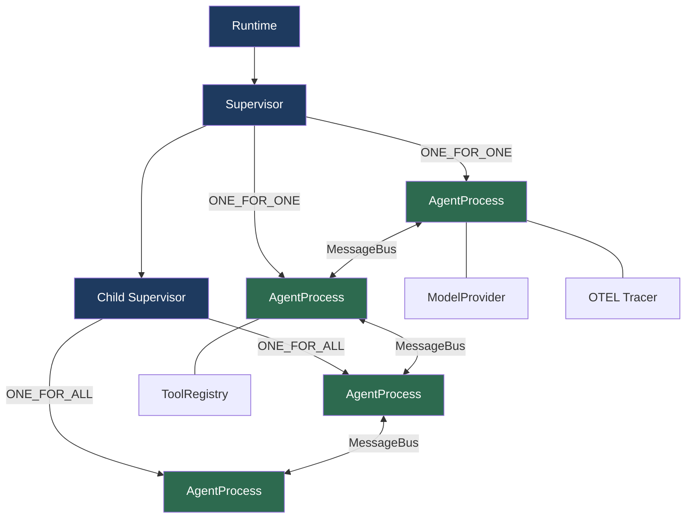
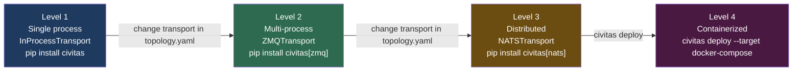
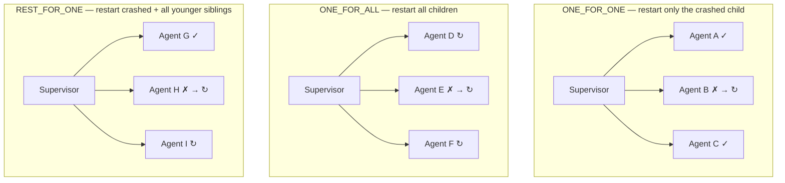

# Civitas

**The production runtime for Python agents.**

---

## Why Civitas?

*Civitas* is the Latin word for city-state — the community of citizens bound by
shared laws, common purpose, and mutual protection.

The root is *civis* (citizen). It gives English: civilization, civic, civil, citizen.
A civitas wasn't just a place — it was a self-governing body that conferred rights,
identity, and protection on those who belonged to it.

Before Civitas, agents were isolated processes: no persistent identity, no rights,
no protection. If one crashed, nothing noticed. Nothing restarted it.

Civitas is the covenant that changes what they are.
It gives agents citizenship: a runtime that watches over them, restarts them on failure,
routes messages between them, and traces every action — automatically.

---

Civitas brings Erlang's battle-tested fault-tolerance model to Python agent systems: supervision trees that restart crashed agents automatically, transport-agnostic message passing that scales from a single script to a distributed cluster, and first-class observability with zero instrumentation code.

```
pip install civitas
```

---

## The problem

Most Python agent frameworks are great at calling LLMs. They are not runtimes. When an agent crashes, nothing restarts it. When a tool hangs, nothing times it out. When you need to scale across machines, you rewrite the routing layer. When something goes wrong in production, you have a log file.

Civitas is the infrastructure layer underneath your agent code. It handles the hard parts — process lifecycle, fault tolerance, message routing, and distributed tracing — so your agents can focus on reasoning.

---

## Quickstart

A supervised agent that crashes occasionally and recovers automatically:

```python
import asyncio
import random
from civitas import AgentProcess, Runtime, Supervisor
from civitas.messages import Message

class FlakyWorker(AgentProcess):
    async def handle(self, message: Message) -> Message | None:
        if random.random() < 0.4:
            raise RuntimeError("transient failure")          # crashes ~40% of the time
        return self.reply({"result": f"processed: {message.payload['task']}"})

async def main():
    runtime = Runtime(
        supervisor=Supervisor(
            "root",
            strategy="ONE_FOR_ONE",   # restart only the crashed child
            max_restarts=5,
            backoff="EXPONENTIAL",
            children=[FlakyWorker("worker")],
        )
    )
    await runtime.start()

    for i in range(10):
        result = await runtime.ask("worker", {"task": f"job-{i}"})
        print(result.payload["result"])   # always succeeds — supervisor handles the rest

    await runtime.stop()

asyncio.run(main())
```

The supervisor detects every crash, applies exponential backoff, and restarts the agent. Your call site never changes.

---

## Core concepts



**`AgentProcess`** — the unit of computation. Subclass it, override `handle()`. Each process has its own mailbox, state, lifecycle hooks, and error boundary.

**`Supervisor`** — monitors child processes and applies restart strategies when they crash. Supervisors nest, forming a tree. Failures propagate upward only when a supervisor exhausts its restart budget.

**`MessageBus`** — routes typed messages between agents by name. Supports fire-and-forget (`send`), request-reply (`ask`), and glob-pattern broadcast.

**`Transport`** — the delivery layer underneath the bus. Swap it in the config, not in your agent code.

---

## Multi-agent example

Three agents forming a research pipeline. Each runs in its own supervised process:

```python
from civitas import AgentProcess, Runtime, Supervisor
from civitas.messages import Message

class Orchestrator(AgentProcess):
    async def handle(self, message: Message) -> Message | None:
        # fan out to researcher, collect, then summarize
        findings = await self.ask("researcher", {"query": message.payload["query"]})
        report   = await self.ask("summarizer", {"findings": findings.payload})
        return self.reply(report.payload)

class Researcher(AgentProcess):
    async def handle(self, message: Message) -> Message | None:
        result = await self.tools.get("web_search").execute(query=message.payload["query"])
        return self.reply({"findings": result})

class Summarizer(AgentProcess):
    async def handle(self, message: Message) -> Message | None:
        response = await self.llm.chat(
            model="claude-haiku-4-5",
            messages=[{"role": "user", "content": str(message.payload["findings"])}],
        )
        return self.reply({"report": response.content})

runtime = Runtime(
    supervisor=Supervisor("root", strategy="ONE_FOR_ONE", children=[
        Orchestrator("orchestrator"),
        Researcher("researcher"),
        Summarizer("summarizer"),
    ]),
    model_provider=AnthropicProvider(),
    tool_registry=tools,
)
```

---

## Scaling ladder

The same agent code runs at every level. The only thing that changes is the topology configuration:



```yaml
# topology.yaml — switch from in-process to distributed by changing one block
transport:
  type: nats           # was: in_process, then: zmq
  url: nats://localhost:4222

supervision:
  name: root
  strategy: ONE_FOR_ONE
  children:
    - agent: { name: orchestrator, type: myapp.Orchestrator }
    - agent: { name: researcher,   type: myapp.Researcher,   process: worker }
    - agent: { name: summarizer,   type: myapp.Summarizer,   process: worker }
```

```bash
civitas run --topology topology.yaml
```

---

## Supervision strategies

When a child crashes, the supervisor applies one of three strategies:



Supervisors nest. If a supervisor exhausts its restart budget, it escalates to its parent. Backoff policies — `CONSTANT`, `LINEAR`, `EXPONENTIAL` — are configured per supervisor.

---

## Automatic observability

Every message, LLM call, and tool invocation generates an OTEL span — no instrumentation code required:

```
[10:00:00.123] orchestrator → researcher: research_query
[10:00:00.135] researcher: llm.chat(claude-haiku-4-5)  1520 → 430 tokens  $0.0089
[10:00:02.025] researcher: tool.invoke(web_search)  450ms  OK
[10:00:02.480] researcher → summarizer: summarize_request
[10:00:02.495] summarizer: llm.chat(claude-haiku-4-5)  890 → 210 tokens  $0.0003
[10:00:03.100] summarizer → orchestrator: reply  OK
─────────────────────────────────────────────────────
Total: 2.977s  |  2 LLM calls  |  $0.0092  |  0 errors
```

To export to Jaeger, Grafana, or any OTEL-compatible backend:

```bash
export OTEL_EXPORTER_OTLP_ENDPOINT=http://localhost:4317
python my_agent.py
```

Trace context propagates automatically across process and machine boundaries.

---

## Hero demo

A research assistant with four supervised agents: an Orchestrator that fans out tasks, a WebResearcher that searches (with retry on transient failures), a Synthesizer, and a Writer.

```bash
# No API key needed — uses a mock LLM
python examples/research_assistant.py "Compare AI safety approaches"

# With a real LLM
export ANTHROPIC_API_KEY=sk-...
python examples/research_assistant.py "Compare AI safety approaches" --live

# With full distributed tracing
docker run -d -p 16686:16686 -p 4317:4317 jaegertracing/all-in-one
export OTEL_EXPORTER_OTLP_ENDPOINT=http://localhost:4317
python examples/research_assistant.py "Compare AI safety approaches"
open http://localhost:16686
```

---

## Install

```bash
pip install civitas                        # core runtime

# Model providers (pick one or more)
pip install civitas[anthropic]             # Anthropic Claude
pip install civitas[openai]                # OpenAI GPT-4o, o1, o3
pip install civitas[gemini]                # Google Gemini 2.0 / 1.5
pip install civitas[mistral]               # Mistral Large / Codestral
pip install civitas[litellm]               # 100+ models via LiteLLM

# Transports
pip install civitas[zmq]                   # ZMQ multi-process transport
pip install civitas[nats]                  # NATS distributed transport

# Observability
pip install civitas[otel]                  # OpenTelemetry SDK + OTLP exporter

# Typical dev setup
pip install civitas[anthropic,otel]
```

**Requires Python 3.12+.**

---

## How Civitas fits in the stack

Civitas is a **runtime**, not a framework. LangGraph, CrewAI, and the OpenAI Agents SDK define how you build agents. Civitas is the infrastructure that keeps them alive.

```
┌──────────────────────────────────────────────┐
│  CONTEXT LAYER                               │
│  Prompts, memory, RAG, AGENTS.md             │
├──────────────────────────────────────────────┤
│  CONTROL LAYER                               │
│  Guardrails, HITL gates, cost limits         │
├──────────────────────────────────────────────┤
│  RUNTIME LAYER  ◄── Civitas lives here        │
│  Process lifecycle, fault tolerance,         │
│  message routing, observability, scaling     │
└──────────────────────────────────────────────┘
```

Civitas wraps LangGraph and OpenAI SDK agents natively:

```python
from civitas.adapters.langgraph import LangGraphAgent

# Your existing LangGraph graph gains supervision,
# message routing, and OTEL tracing in 3 lines.
class MyLangGraphAgent(LangGraphAgent):
    graph = compiled_graph
```

---

## Compared to alternatives

| | Civitas | Temporal | LangGraph | CrewAI |
|---|---|---|---|---|
| **Category** | Agent runtime | Durable execution | Agent orchestration | Agent framework |
| **Supervision trees** | ✓ | ✗ | ✗ | ✗ |
| **Restart strategies** | ONE_FOR_ONE, ONE_FOR_ALL, REST_FOR_ONE | Retry policies (activity level) | ✗ | ✗ |
| **Message passing** | First-class MessageBus | Signals (limited) | Graph edges (static) | ✗ |
| **Transport abstraction** | InProcess → ZMQ → NATS | Worker polling | In-process only | In-process only |
| **Agent identity** | Persistent named process | Workflow instance | Graph node | Role object |
| **OTEL tracing** | Automatic, zero code | Manual | Manual | ✗ |
| **LLM-native** | ModelProvider protocol | Bring your own | ChatModel built-in | Built-in |
| **License** | Apache 2.0 | MIT | Proprietary (LangSmith) | MIT |

**Temporal** excels at linear pipelines requiring durable execution. Civitas wins for multi-agent systems with dynamic routing and supervision hierarchies. They're complementary — Temporal can run inside a Civitas activity.

**LangGraph** is great for single-agent graphs with checkpointing and HITL gates. The [`LangGraphAgent`](docs/adapters.md) adapter runs a compiled graph inside a Civitas process, giving it supervision and transport for free.

---

## Examples

```bash
python examples/hello_agent.py           # simplest possible agent
python examples/supervised_agent.py      # crash + auto-restart
python examples/research_pipeline.py     # three-agent pipeline
python examples/self_sufficient_agent.py # agent with LLM and tools
python examples/observable_pipeline.py   # full OTEL tracing
python examples/supervision_tree.py      # nested supervision strategies
python examples/research_assistant.py    # four-agent hero demo
python examples/stateful_workflow.py     # state persistence across restarts
```

---

## CLI

Civitas ships a full CLI for running, inspecting, and deploying agent systems.

```
civitas run          — start a topology (supervisor or worker process)
civitas topology     — validate, visualise, and diff topology files
civitas state        — inspect and manage persisted agent state
civitas deploy       — generate Docker Compose deployment artifacts
civitas version      — show the installed version
```

**Run a topology:**

```bash
# Start the supervisor process
civitas run --topology topology.yaml

# Start a worker process (for agents with process: worker in the topology)
civitas run --topology topology.yaml --process worker

# Override transport at runtime without editing the file
civitas run --topology topology.yaml --transport nats --nats-url nats://prod:4222
```

**Validate before deploying (CI-safe — exits 1 on error):**

```bash
civitas topology validate topology.yaml
```

**Visualise the supervision tree:**

```bash
civitas topology show topology.yaml
# root  ONE_FOR_ONE  restarts: 5/60s  backoff: exponential
# ├── orchestrator  myapp.Orchestrator
# ├── researcher    myapp.Researcher    @worker
# └── summarizer    myapp.Summarizer    @worker
#
# Transport   nats  nats://localhost:4222
# Plugins     anthropic  sqlite
# Topology    3 agents  ·  1 supervisors  ·  1 processes
```

**Diff two topology files (e.g. staging vs production):**

```bash
civitas topology diff topology.staging.yaml topology.prod.yaml
# Supervision
#   ~ /root/researcher/@class   myapp.StubResearcher → myapp.Researcher
# Transport
#   ~ transport/@type           in_process → nats
# 2 changed
```

**Inspect persisted agent state:**

```bash
civitas state list --db civitas_state.db
civitas state clear orchestrator --db civitas_state.db   # clear one agent
civitas state clear --force --db civitas_state.db        # clear all
```

**Generate a Docker Compose stack from a topology:**

```bash
civitas deploy docker-compose --topology topology.yaml --output ./deploy
# Generates: Dockerfile, docker-compose.yml, .env

cd deploy
echo "ANTHROPIC_API_KEY=sk-ant-..." >> .env
docker compose up --build

# Scale workers horizontally
docker compose up --scale worker-worker=3
```

---

## Documentation

Full documentation is available at **[jerynmathew.github.io/python-civitas](https://jerynmathew.github.io/python-civitas/)**.

| | |
|---|---|
| [Getting Started](https://jerynmathew.github.io/python-civitas/getting-started/) | Install, hello agent, first supervised system |
| [Core Concepts](https://jerynmathew.github.io/python-civitas/concepts/) | AgentProcess, Supervisor, MessageBus, Transport |
| [Supervision](https://jerynmathew.github.io/python-civitas/supervision/) | Strategies, backoff, escalation, heartbeats |
| [Messaging](https://jerynmathew.github.io/python-civitas/messaging/) | send, ask, broadcast, backpressure, trace propagation |
| [Transports](https://jerynmathew.github.io/python-civitas/transports/) | InProcess → ZMQ → NATS, switching levels |
| [Observability](https://jerynmathew.github.io/python-civitas/observability/) | OTEL spans, console exporter, Jaeger setup |
| [Plugins](https://jerynmathew.github.io/python-civitas/plugins/) | ModelProvider, ToolProvider, StateStore, custom plugins |
| [Topology YAML](https://jerynmathew.github.io/python-civitas/topology/) | Schema reference, CLI commands |
| [CLI Reference](https://jerynmathew.github.io/python-civitas/cli/) | All commands, options, and examples |
| [Deployment](https://jerynmathew.github.io/python-civitas/deployment/) | Level 1–4 deployment ladder |
| [Framework Adapters](https://jerynmathew.github.io/python-civitas/adapters/) | LangGraph, OpenAI SDK integration |
| [Architecture](https://jerynmathew.github.io/python-civitas/architecture/) | Runtime internals, component wiring |
| [FAQ](https://jerynmathew.github.io/python-civitas/faq/) | Why not Temporal? Why not LangGraph? GIL concerns |
| [Contributing](https://jerynmathew.github.io/python-civitas/contributing/) | Dev setup, test strategy, plugin authoring |

---

## License

Apache 2.0. See [LICENSE](LICENSE).
