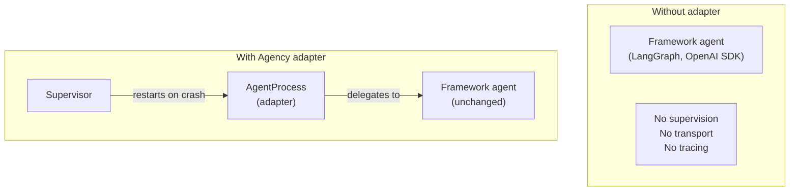

# Adapters

Agency provides adapters that wrap third-party agent frameworks as `AgentProcess` instances. A wrapped agent gains Agency's supervision tree, transport-agnostic messaging, and automatic OTEL tracing — without rewriting the underlying framework code.

---

## What an adapter gives you



The adapter is a thin shell. The framework agent runs inside `handle()`. If it raises an unhandled exception, the supervisor restarts it exactly as it would any native `AgentProcess`.

---

## LangGraphAgent

Wraps a LangGraph `CompiledGraph` as an `AgentProcess`. The graph receives `message.payload` as its input state and its output dict becomes the reply payload.

**Install:**

```bash
pip install python-agency langgraph
```

**Basic usage:**

```python
from langgraph.graph import StateGraph, END
from typing import TypedDict

from agency import Runtime, Supervisor
from agency.adapters.langgraph import LangGraphAgent


# Define your LangGraph graph as usual
class State(TypedDict):
    question: str
    answer: str

def answer_node(state: State) -> State:
    return {"answer": f"Answer to: {state['question']}"}

graph = StateGraph(State)
graph.add_node("answer", answer_node)
graph.set_entry_point("answer")
graph.add_edge("answer", END)
compiled = graph.compile()


# Wrap it in an Agency adapter — one line
runtime = Runtime(
    supervisor=Supervisor(
        "root",
        children=[
            LangGraphAgent("my_graph", graph=compiled),
        ],
    )
)
```

Calling the agent from another agent or from the runtime:

```python
response = await runtime.ask("my_graph", {"question": "What is Agency?"})
print(response.payload["answer"])
```

**With typed input validation:**

Pass `input_schema` to coerce the message payload through a typed dict before the graph runs. This catches payload mismatches early with a clear error rather than a deep LangGraph `ValidationError`:

```python
LangGraphAgent(
    "my_graph",
    graph=compiled,
    input_schema=State,   # validates payload keys and types before ainvoke()
)
```

**How it works:**

```python
async def handle(self, message: Message) -> Message | None:
    payload = self._input_schema(**message.payload) if self._input_schema else message.payload
    output = await self._graph.ainvoke(payload)
    return self.reply(output if isinstance(output, dict) else {"output": output})
```

The graph's `ainvoke()` is called with the message payload. Non-dict outputs (e.g. a string from a simple graph) are wrapped in `{"output": value}` automatically.

**Supervision in action:**

If the LangGraph graph raises an unhandled exception — network error, LLM timeout, validation failure — the exception propagates to `on_error()`, which escalates to the supervisor. The supervisor applies its backoff policy and restarts `LangGraphAgent`. The graph itself is stateless (the `compiled` object is not mutated), so restart is safe.

**Subclassing for retry logic:**

The adapter's `on_error()` escalates by default. Override `_is_transient()` to retry on specific errors:

```python
import httpx
from agency.adapters.langgraph import LangGraphAgent

class ResilientGraphAgent(LangGraphAgent):
    def _is_transient(self, error: Exception) -> bool:
        # Retry on network timeouts; escalate everything else
        return isinstance(error, httpx.TimeoutException)
```

**Limitations:**

- LangGraph's built-in `MemorySaver` / `SqliteSaver` checkpointing runs independently of Agency's `StateStore`. If you use LangGraph checkpointing, the graph's internal state is managed by LangGraph; `self.state` in the adapter is separate.
- LangGraph streaming (`graph.astream()`) is not forwarded through Agency's message protocol. The adapter waits for `ainvoke()` to complete and replies once. If you need streaming, do it inside the graph node itself.
- LangGraph human-in-the-loop interrupts (`interrupt()`) pause the graph inside `ainvoke()`. The adapter will block until the interrupt is resolved. Use a short `ask()` timeout at the caller and design your interrupt resolution flow accordingly.

---

## OpenAIAgent

Wraps an OpenAI Agents SDK `Agent` as an `AgentProcess`. Incoming messages must include an `"input"` key. The agent's final text output is returned as `{"output": ...}`. Handoffs are mapped to Agency `send()` calls.

**Install:**

```bash
pip install python-agency openai-agents
```

**Basic usage:**

```python
from agents import Agent
from agency import Runtime, Supervisor
from agency.adapters.openai import OpenAIAgent

# Define your OpenAI agent as usual
assistant = Agent(
    name="assistant",
    instructions="You are a helpful assistant. Answer concisely.",
)

# Wrap it
runtime = Runtime(
    supervisor=Supervisor(
        "root",
        children=[
            OpenAIAgent("assistant", agent=assistant),
        ],
    )
)
```

Sending a message:

```python
response = await runtime.ask("assistant", {"input": "What is the capital of France?"})
print(response.payload["output"])   # "Paris."
```

**Handoffs between agents:**

If the OpenAI agent hands off to another agent, the handoff is translated to an Agency `send()` call — the target agent must be registered in the supervision tree:

```python
from agents import Agent, handoff

researcher = Agent(name="researcher", instructions="Search and return facts.")
writer = Agent(
    name="writer",
    instructions="Write a summary based on research.",
    handoffs=[handoff(researcher)],
)

runtime = Runtime(
    supervisor=Supervisor(
        "root",
        children=[
            OpenAIAgent("writer", agent=writer),
            OpenAIAgent("researcher", agent=researcher),
        ],
    )
)
```

When `writer` hands off to `researcher`, the adapter calls `await self.send("researcher", {"input": ...})`. If `researcher` is not registered in Agency, a warning is logged and execution continues — it does not crash:

```
[OpenAIAgent] handoff to 'researcher' failed — not registered in Agency
```

**How it works:**

```python
async def handle(self, message: Message) -> Message | None:
    from agents import Runner

    user_input = message.payload.get("input")
    if user_input is None:
        return self.reply({"error": "payload must include 'input' key"})

    result = await Runner.run(self._agent, input=user_input)

    # Map handoffs to Agency send() calls
    for item in getattr(result, "new_items", []):
        if hasattr(item, "agent") and hasattr(item, "input"):
            await self.send(item.agent.name, {"input": item.input})

    return self.reply({"output": result.final_output})
```

**Subclassing for transient error retry:**

```python
from openai import RateLimitError
from agency.adapters.openai import OpenAIAgent

class ResilientOpenAIAgent(OpenAIAgent):
    def _is_transient(self, error: Exception) -> bool:
        return isinstance(error, RateLimitError)
```

**Limitations:**

- The adapter uses `Runner.run()` (non-streaming). Streaming responses are not propagated via Agency messages.
- OpenAI Agents SDK tool calls are executed inside the `Runner` — they are not exposed as Agency `ToolProvider` calls and do not generate Agency tool spans.
- Handoff target names must match the `name` field of the `AgentProcess` registered in Agency, not the `Agent.name` from the OpenAI SDK (which may differ).

---

## What the adapter pattern gives you

Both adapters provide the same benefits regardless of which framework is wrapped:

**Supervision.** A crashed graph or agent is restarted by the supervisor according to the configured strategy and backoff. `max_restarts` and `restart_window` are respected.

**Transport.** The adapter is a full `AgentProcess`. It can run in-process, in a separate OS process via ZMQ, or on a remote machine via NATS — determined by `process:` in the topology YAML. The framework agent code is unchanged.

**OTEL tracing.** The `agency.agent.handle` span is emitted for every message. If you call `self.llm.chat()` or `self.tool_span()` inside the adapter, those spans are linked to the same trace. Framework-internal LLM calls (made by the OpenAI SDK's `Runner`, or by LangGraph nodes) do not generate Agency spans unless you add `self.llm_span()` wrappers explicitly.

**Named addressing.** Other agents and the runtime address the wrapped agent by its Agency name, not by any framework-internal identity. Routing, broadcast, and request-reply work identically to native agents.

---

## Writing your own adapter

Any framework that has an async `run()` / `invoke()` / `chat()` method can be wrapped in three steps:

```python
from agency.process import AgentProcess
from agency.messages import Message
from agency.errors import ErrorAction

class MyFrameworkAgent(AgentProcess):
    def __init__(self, name: str, framework_agent, **kwargs):
        super().__init__(name, **kwargs)
        self._agent = framework_agent

    async def handle(self, message: Message) -> Message | None:
        # Delegate to the framework agent
        result = await self._agent.run(message.payload)
        return self.reply({"output": result})

    def _is_transient(self, error: Exception) -> bool:
        # Return True for errors worth retrying before escalating to supervisor
        return False

    async def on_error(self, error: Exception, message: Message) -> ErrorAction:
        if message.attempt < self._max_retries and self._is_transient(error):
            return ErrorAction.RETRY
        return ErrorAction.ESCALATE
```

The three things every adapter must do:
1. Call `super().__init__(name, **kwargs)` — wires up the mailbox, tracer, and injected plugins
2. Delegate to the framework in `handle()` and return `self.reply(...)` or `None`
3. Implement `on_error()` — at minimum, return `ErrorAction.ESCALATE` to let the supervisor handle failures
