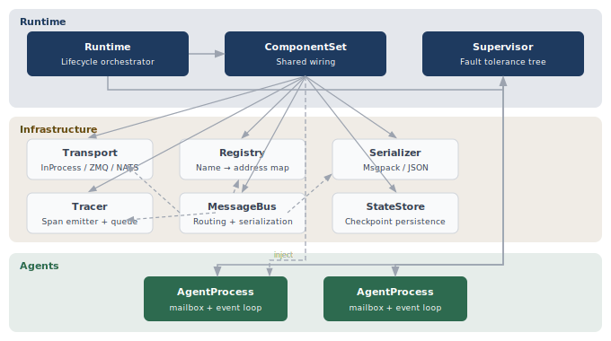
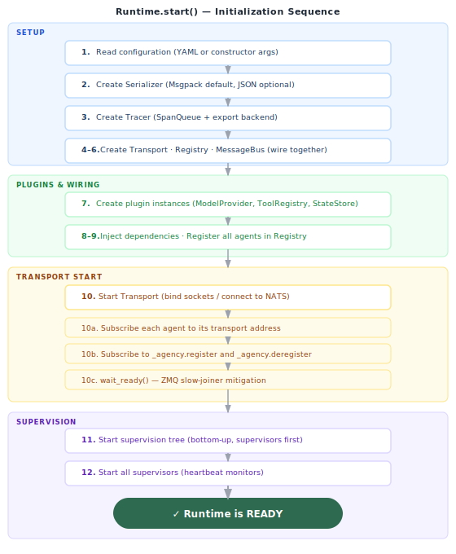
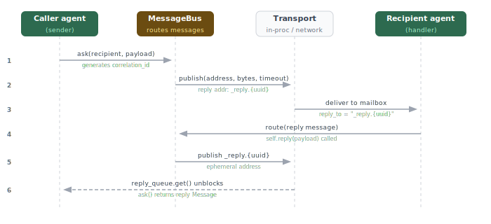
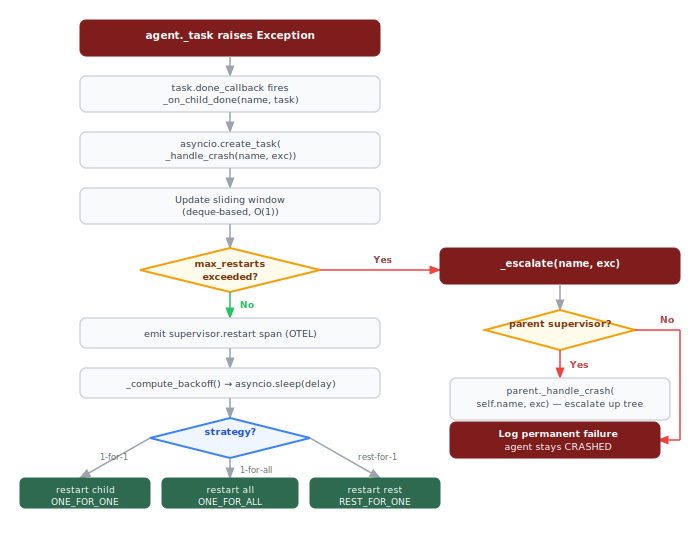
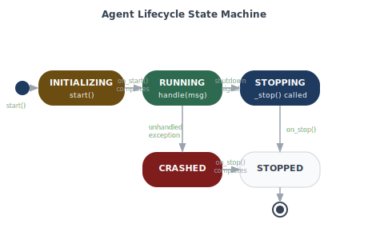
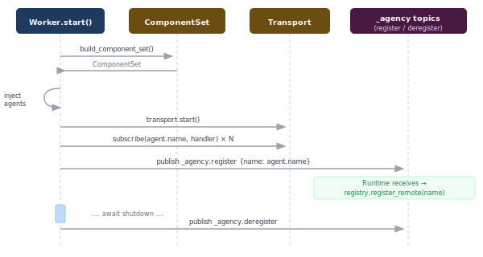

# Architecture

Internal reference for contributors and advanced users. Covers the runtime startup sequence, component wiring, message flow, fault handling, and key design decisions.

---

## Component map



Every component except `Supervisor` and `AgentProcess` lives in `ComponentSet`. `Runtime.start()` assembles the `ComponentSet`, injects it into every agent, then hands control to the supervisor tree.

---

## Runtime startup sequence

The startup sequence is defined in `Runtime.start()` and documented in the class docstring. Steps are in strict order — each depends on the previous.



**Key invariants:**
- Transport is started (step 10) before agents are started (step 11) — agents begin receiving messages the moment they start, so the delivery layer must be ready first.
- All agents are registered in the Registry (step 9) before the transport subscribes them (step 10) — the Registry is the authoritative source for routing; transport subscription is mechanical delivery.
- `wait_ready()` (step 10d) is a ZMQ-specific delay to mitigate the ZMQ slow-joiner problem. For InProcess and NATS, `wait_ready()` is a no-op.

---

## ComponentSet — shared wiring

`ComponentSet` is a dataclass that holds the six infrastructure objects shared by `Runtime` and `Worker`. Its `__post_init__` assembles the `MessageBus` from its four dependencies:

```python
@dataclass
class ComponentSet:
    transport: Transport
    registry: Registry
    serializer: Serializer
    tracer: Tracer
    store: StateStore | None
    model_provider: ModelProvider | None
    tool_registry: ToolRegistry | None
    bus: MessageBus  # built in __post_init__

    def inject(self, agent: AgentProcess) -> None:
        agent._bus = self.bus
        agent._tracer = self.tracer
        agent.llm = self.model_provider
        agent.tools = self.tool_registry
        agent.store = self.store
```

`build_component_set()` constructs a `ComponentSet` from primitive config values. This is called by `Runtime.start()` and `Worker.start()` when no pre-built `ComponentSet` is provided.

**Why a separate `ComponentSet`?** Both `Runtime` (the supervisor process) and `Worker` (a worker process) need identical infrastructure wiring. Extracting it into `ComponentSet` means the wiring logic is written once and tested once — neither `Runtime` nor `Worker` constructs components directly.

---

## Message flow — end to end

This sequence traces a single `ask()` from one agent to another and back.



**Trace propagation:** The `trace_id` and `span_id` from the original message are carried in all downstream messages. `bus.request()` creates the initial span; every subsequent `handle()` creates a child span linked by `parent_span_id`. This chain works across process and machine boundaries because trace IDs are embedded in the serialized message payload — not in thread-local storage.

---

## Fault handling path

When an agent's asyncio task raises an unhandled exception, control flows through the supervisor:



**Sliding window** (`_restart_timestamps`): A `deque` of crash timestamps. On each crash, the current time is appended and entries older than `restart_window` seconds are popped from the left. If the deque length exceeds `max_restarts`, the supervisor escalates. This is O(1) per crash.

**Backoff computation:**

```python
def _compute_backoff(self, restart_count: int) -> float:
    if self.backoff == BackoffPolicy.CONSTANT:
        delay = self.backoff_base
    elif self.backoff == BackoffPolicy.LINEAR:
        delay = self.backoff_base * restart_count
    elif self.backoff == BackoffPolicy.EXPONENTIAL:
        delay = self.backoff_base * (2 ** (restart_count - 1))
        delay += delay * random.random() * 0.25   # 25% jitter
    return min(delay, self.backoff_max)
```

Jitter is added to exponential backoff to prevent all agents from thundering back simultaneously after a shared dependency recovers.

**Remote agent crash:** If the crashed agent is in `_remote_children` (a worker process), `_restart_child()` routes a `_agency.restart` message to `_agency.worker.restart`. The Worker process receives it and calls `agent._start()` locally. The supervisor continues monitoring via heartbeats.

---

## Ephemeral reply routing

Request-reply (`ask()` / `self.ask()`) uses ephemeral addresses that exist only for the duration of a single request. The implementation differs per transport but the interface is uniform.

**InProcessTransport:**

The transport creates a temporary `asyncio.Queue` keyed by a UUID. The request message is delivered to the recipient's subscription. When the recipient calls `self.reply()`, the reply is routed to the ephemeral address (`_reply.{uuid}`). The transport's `has_reply_address()` returns `True` for this UUID, so the bus routes directly to the queue. The caller's `transport.request()` awaits the queue with a timeout.

**ZMQTransport:**

A unique reply topic (`_reply.{uuid}`) is subscribed before publishing the request. The reply message carries this topic as the recipient. ZMQ delivers the reply via the XSUB/XPUB proxy to the waiting subscription. The subscription is torn down after the reply arrives or the timeout fires.

**NATSTransport:**

NATS has built-in request-reply support via inbox subjects (`_INBOX.{id}`). The `nats-py` client handles creation and cleanup of the ephemeral subscription automatically.

**Routing resolution in `MessageBus.route()`:**

```
1. Registry.lookup(recipient)        → use RoutingEntry.address
2. Transport.has_reply_address()     → publish directly (same-process reply)
3. recipient.startswith("_reply.")   → publish directly (cross-process reply)
4. None of the above                 → raise MessageRoutingError
```

The distinction between cases 2 and 3 matters for ZMQ and NATS: the reply address is registered in the transport's internal state, not in the Registry, so the Registry lookup fails. The bus falls back to transport-level routing.

---

## Registry — name to address mapping

`LocalRegistry` maps agent names to `RoutingEntry` objects:

```python
@dataclass
class RoutingEntry:
    name: str
    address: str       # transport address (same as name for local agents)
    is_local: bool     # True for agents in this process
```

For local agents, `address == name`. For remote agents announced via `_agency.register`, `address` is still the agent name — transport routing uses the name as the NATS subject or ZMQ topic directly.

Glob matching (`registry.lookup_all("worker.*")`) is used for broadcast (`self.broadcast()`). `LocalRegistry` uses Python's `fnmatch` for pattern matching.

**Remote agent discovery:** When a `Worker` starts, it publishes `_agency.register` messages for each agent it hosts. The Runtime's startup (step 10c) subscribes to this topic and calls `registry.register_remote(name)` for each announcement. When a Worker stops, it publishes `_agency.deregister`.

---

## AgentProcess internals

Each `AgentProcess` runs as a single asyncio task (`agent._task`). Inside that task:



**Mailbox:** An `asyncio.Queue` with a bounded capacity (default: 1000 messages). `receive()` calls `put_nowait()` — if the mailbox is full, `asyncio.QueueFull` is raised and the message is dropped with a warning. The agent's event loop calls `get()` to dequeue messages one at a time.

**State restore:** On `INITIALIZING → RUNNING` transition (inside `_start()`), the runtime calls `store.get(agent.name)` and assigns the result to `self.state` before `on_start()` runs. This means `on_start()` always sees the last checkpointed state, whether the agent is starting for the first time or restarting after a crash.

**`_max_retries`:** `AgentProcess` exposes `_max_retries = 3` as a class attribute. `on_error()` can compare `message.attempt` against this to decide whether to retry or escalate. The `attempt` field on `Message` is incremented by the bus each time the message is redelivered.

---

## Serialization

All messages — including in-process ones — are serialized. This is a deliberate design decision: it ensures that swapping from `InProcessTransport` to `ZMQTransport` or `NATSTransport` never requires agent code changes, because agents never rely on object identity or non-serializable types in message payloads.

`MsgpackSerializer` (default) is significantly faster than JSON and produces smaller payloads. `JsonSerializer` is available for debugging or interoperability. Both implement the same `Serializer` protocol:

```python
class Serializer(Protocol):
    def serialize(self, message: Message) -> bytes: ...
    def deserialize(self, data: bytes) -> Message: ...
```

`AGENCY_SERIALIZER=json` switches to JSON at startup. Both serializers must produce identical `Message` objects from valid payloads.

---

## Tracer and SpanQueue

The `Tracer` never blocks the message loop. Span emission goes through a `SpanQueue`:


If `put_nowait()` raises `QueueFull` (10,000 spans buffered), the oldest span is evicted to make room. Losing a span is always preferable to stalling the message loop.

**Three output modes** (selected automatically at `Tracer()` construction):
1. No `opentelemetry-sdk` → Python `logging` at `DEBUG` level
2. `opentelemetry-sdk` installed, no `OTEL_EXPORTER_OTLP_ENDPOINT` → `ConsoleSpanExporter` (JSON to stdout)
3. `opentelemetry-sdk` + `OTEL_EXPORTER_OTLP_ENDPOINT` set → `BatchSpanProcessor` + OTLP gRPC export

`Runtime.stop()` calls `tracer.flush()` which drains the `SpanQueue` before the process exits.

---

## Worker process wiring

A `Worker` has the same `ComponentSet` as a `Runtime` — same transport, registry, serializer, tracer. The difference is that a `Worker` has no supervision tree. It hosts agents directly and does not manage restarts.



The supervisor in the main process monitors worker agents via heartbeats. When a heartbeat is missed, the supervisor sends `_agency.restart` → the Worker restarts the named agent locally → the agent publishes `_agency.register` again → the Registry entry is refreshed.

---

## Key design decisions

**Structural protocols, not base classes for plugins.** `ModelProvider`, `StateStore`, `ExportBackend`, and `Transport` are all `typing.Protocol` classes. Any class with the right method signatures satisfies them — no inheritance, no registration. This makes plugins trivial to write and test without importing Civitas internals.

**Serialize everything, even in-process.** The InProcess transport still serializes messages through Msgpack. This makes transport swapping truly transparent and catches non-serializable payloads at development time rather than in production.

**Jitter on exponential backoff.** Without jitter, all agents that crashed simultaneously (e.g., after a shared dependency went down) would restart at exactly the same time and potentially overwhelm the dependency again. 25% random jitter spreads restarts across a window.

**`deque` for the sliding window.** The restart rate limiter uses `collections.deque` with O(1) `append` and `popleft`. A list would be O(n) for `pop(0)`. At high restart rates this matters.

**O(1) agent lookup.** `Runtime._agents_by_name` and `Supervisor._children_by_name` are dicts built at startup. `Runtime.get_agent(name)` and `Supervisor._find_child(name)` are both O(1). A tree walk would be O(n) for every lookup.

**Crash handlers as tracked tasks.** `_on_child_done()` creates a new asyncio task for `_handle_crash()` and adds it to `_pending_crash_tasks`. `Supervisor.stop()` cancels all pending crash tasks before tearing down children. Without this, a crash handler could race with the shutdown sequence and attempt to restart an agent that is in the process of being stopped.

**System message namespace reserved.** Messages with types prefixed `_agency.` are reserved for internal use (`_agency.heartbeat`, `_agency.restart`, `_agency.register`, `_agency.deregister`). `MessageBus.route()` validates this — application code that accidentally uses the prefix gets a `MessageValidationError` at runtime rather than silent interference with the control plane.
