# Core Concepts

This document explains the mental model behind Civitas. Read it once to understand why the pieces are shaped the way they are — the rest of the docs assume this foundation.

---

## The OTP connection

Civitas is built on ideas borrowed from Erlang/OTP — specifically from [GenServer](https://hexdocs.pm/elixir/GenServer.html) and [Supervisor](https://hexdocs.pm/elixir/Supervisor.html). Erlang's production record over 30+ years comes not from the language itself but from two architectural ideas:

1. **Let it crash.** Errors should not be hidden with defensive code. Let processes fail cleanly. Something else — a supervisor — is responsible for deciding what to do next.
2. **Hierarchical process trees.** Processes are organized into trees. Each node in the tree is responsible for the health of its children. Failure propagates upward only when a node exhausts its own recovery options.

These ideas translate directly to AI agent systems. Agents crash. LLM calls fail. Tools time out. Networks partition. A runtime that treats failure as normal — rather than exceptional — produces systems that stay up.

Civitas brings these patterns to Python using asyncio, without requiring Erlang, the BEAM VM, or the JVM.

---

## System overview

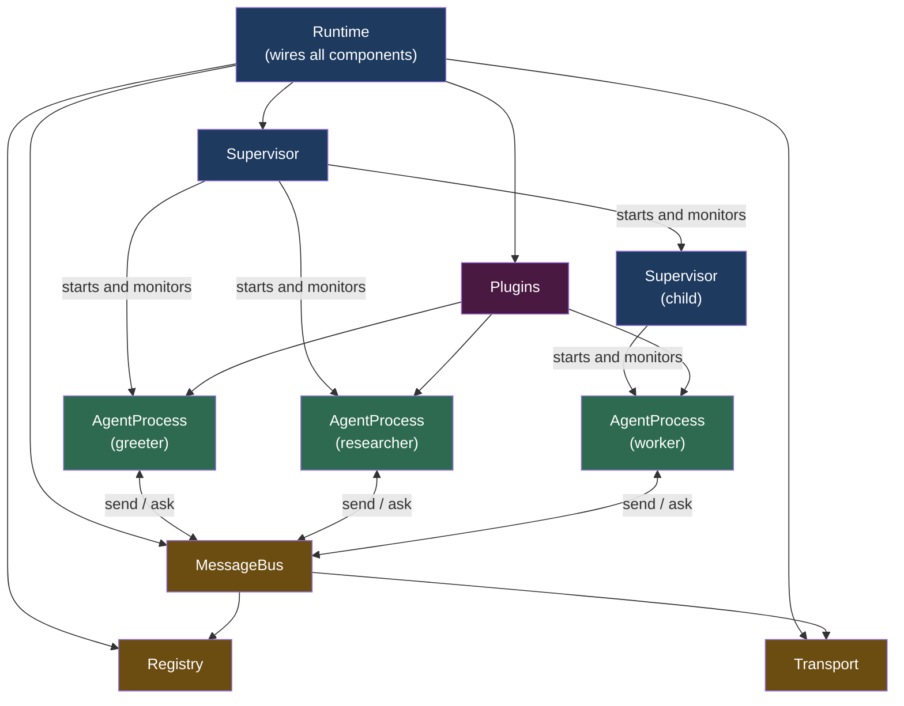

Each component has a single responsibility. `Runtime` assembles them; it doesn't own business logic.

---

## AgentProcess

`AgentProcess` is the unit of computation — the Python equivalent of an Erlang GenServer.

Each instance has:
- Its own **mailbox** — a bounded async queue of incoming messages
- Its own **state** — a plain dict, private to that process
- Its own **error boundary** — exceptions in `handle()` do not propagate to callers
- An asyncio `Task` running its message loop

### Lifecycle

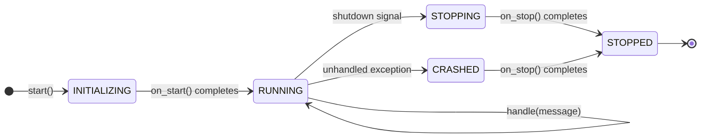

Four hooks to override:

```python
class MyAgent(AgentProcess):
    async def on_start(self) -> None:
        # Called once before the first message.
        # Initialize self.state, open connections, load models.
        self.state["counter"] = 0

    async def handle(self, message: Message) -> Message | None:
        # Called for every incoming message.
        # Return self.reply(...) for request-reply; None for fire-and-forget.
        self.state["counter"] += 1
        return self.reply({"count": self.state["counter"]})

    async def on_error(self, error: Exception, message: Message) -> ErrorAction:
        # Called when handle() raises.
        # Return what the runtime should do next.
        if isinstance(error, TransientError):
            return ErrorAction.RETRY      # re-deliver this message
        return ErrorAction.ESCALATE       # crash; let the supervisor decide

    async def on_stop(self) -> None:
        # Called on graceful shutdown — always, even on crash.
        # Close connections, flush buffers.
        pass
```

### Error actions

| `ErrorAction` | Behavior |
|---|---|
| `RETRY` | Re-deliver the same message (up to `max_retries`, default 3) |
| `SKIP` | Discard the failed message, continue with the next |
| `ESCALATE` | Mark the process as `CRASHED`; the supervisor takes over |
| `STOP` | Graceful shutdown of this process only |

The default `on_error` returns `ESCALATE`. Override it only if you have a meaningful retry or skip policy.

### Injected dependencies

The runtime injects four optional dependencies at startup. You don't construct them yourself:

| Attribute | Type | What it is |
|---|---|---|
| `self.llm` | `ModelProvider` | LLM calls — `await self.llm.chat(model, messages)` |
| `self.tools` | `ToolRegistry` | Tool lookup — `self.tools.get("name")` |
| `self.store` | `StateStore` | State persistence — `await self.checkpoint()` |
| `self._tracer` | `Tracer` | Span creation — used via `llm_span()` / `tool_span()` |

If a dependency is not configured in the `Runtime`, the attribute is `None`.

### State and checkpointing

`self.state` is a plain dict. It is not automatically persisted. To survive a process restart:

```python
async def handle(self, message: Message) -> Message | None:
    self.state["step"] = self.state.get("step", 0) + 1
    await self.checkpoint()   # writes self.state to the configured StateStore
    return self.reply({"step": self.state["step"]})
```

On restart, the runtime restores `self.state` from the last checkpoint before calling `on_start()`. Agents that never call `checkpoint()` incur zero overhead.

---

## Supervisor

The `Supervisor` monitors its children and applies a restart strategy when any of them crashes.

```python
Supervisor(
    "root",
    strategy="ONE_FOR_ONE",   # or ONE_FOR_ALL, REST_FOR_ONE
    max_restarts=5,           # max crashes before escalating
    restart_window=60.0,      # sliding window (seconds) for counting crashes
    backoff="EXPONENTIAL",    # or CONSTANT, LINEAR
    backoff_base=1.0,         # initial backoff delay in seconds
    backoff_max=60.0,         # maximum backoff delay
    children=[
        MyAgent("agent-a"),
        MyAgent("agent-b"),
        AnotherAgent("agent-c"),
    ],
)
```

### Restart strategies

**ONE_FOR_ONE** — restart only the crashed child. Other children are unaffected.

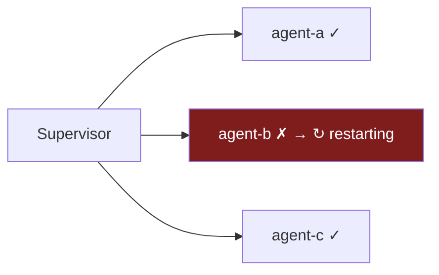

Use when children are independent of each other.

---

**ONE_FOR_ALL** — restart all children when any one crashes.

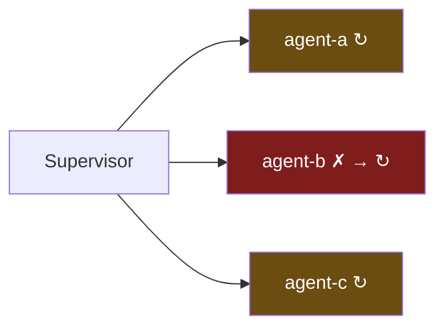

Use when children share state or must be synchronized — a crash in one means the others' state is no longer valid.

---

**REST_FOR_ONE** — restart the crashed child and all children started after it (younger siblings). Children started before are unaffected.

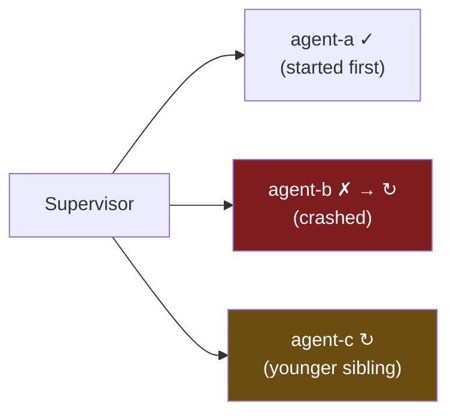

Use for pipeline-style systems where later stages depend on earlier ones — restart the broken stage and everything downstream.

---

### Escalation

When a supervisor exceeds `max_restarts` within `restart_window`, it gives up and escalates to its own parent supervisor:

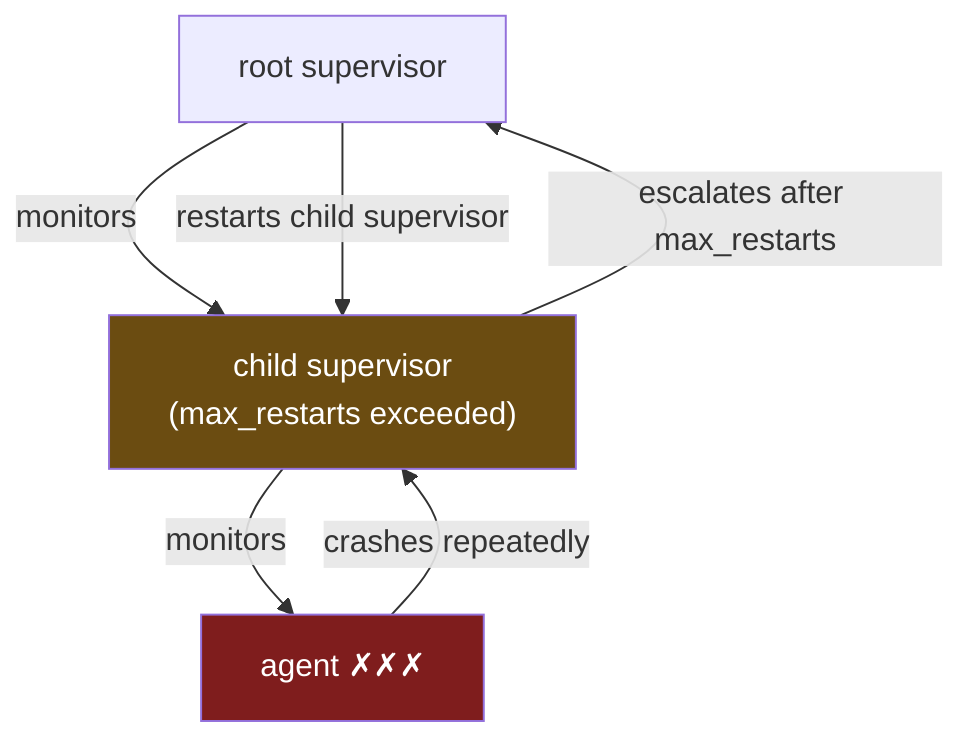

This is the tree structure working as designed: local problems are handled locally; only persistent failures propagate upward.

### Backoff

Each restart attempt waits a calculated delay before starting the child:

| Policy | Formula | Example (base=1.0s) |
|---|---|---|
| `CONSTANT` | `base` | 1s, 1s, 1s, ... |
| `LINEAR` | `base × attempt` | 1s, 2s, 3s, 4s, ... |
| `EXPONENTIAL` | `base × 2^attempt` ± jitter | 1s, 2s, 4s, 8s, ... |

`EXPONENTIAL` is the default for production systems. It prevents retry storms when a dependency is down.

---

## Message

`Message` is the standard envelope for all inter-agent communication. It carries routing metadata, observability context, and your application payload.

```python
@dataclass
class Message:
    id: str               # UUID7 — time-sortable, globally unique
    type: str             # application-defined message type (default: "message")
    sender: str           # agent name that sent this message
    recipient: str        # agent name this message is addressed to
    payload: dict         # your data — must be JSON-serializable

    # Request-reply
    correlation_id: str | None   # links a reply to its originating request
    reply_to: str | None         # ephemeral address for the reply

    # Observability
    trace_id: str                # distributed trace identifier
    span_id: str                 # this message's span
    parent_span_id: str | None   # the span that caused this message

    # Runtime
    timestamp: float     # unix timestamp at creation
    attempt: int         # retry count (incremented on RETRY)
    priority: int        # > 0 for system messages (jump the queue)
```

### Payload rules

- Must contain only JSON-serializable values: `str`, `int`, `float`, `bool`, `None`, `list`, `dict`
- No custom objects, no bytes, no non-serializable types
- Validation is enforced at construction time — you'll get a `ValueError` immediately if the payload is invalid

This constraint exists because all messages are serialized to msgpack before delivery, even in single-process mode. It's what makes the "swap transport without changing agent code" promise hold.

### System messages

Message types prefixed with `_agency.` are reserved for runtime internals (heartbeat, shutdown, restart, registration). Application code must never create messages with these types.

---

## MessageBus and Registry

The `MessageBus` routes messages between agents. The `Registry` maps agent names to their delivery addresses.

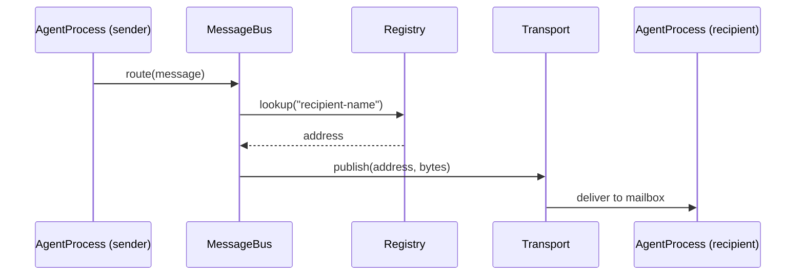

From the agent's perspective: you call `self.send("other-agent", {...})` and the message arrives in `other-agent`'s `handle()`. The routing layer is invisible.

The Registry is also used for pattern-matching in `broadcast`. A call to `self.broadcast("workers.*", payload)` delivers to every registered agent whose name matches the glob.

---

## Transport

The `Transport` is the delivery layer underneath the MessageBus. It has five methods:

```python
async def start() -> None
async def stop() -> None
async def subscribe(address: str, handler: Callable) -> None
async def publish(address: str, data: bytes) -> None
async def request(address: str, data: bytes, timeout: float) -> bytes
```

Three implementations are provided:

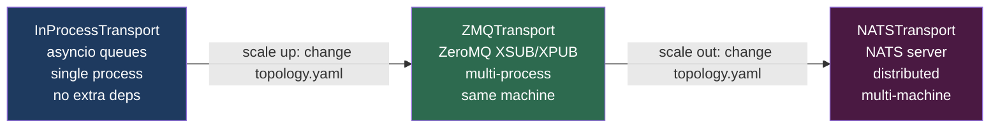

Agent code never references the transport directly. The runtime injects it. Switching from `InProcessTransport` to `NATSTransport` requires changing one line in your topology YAML.

Messages are serialized to msgpack bytes before being handed to the transport, regardless of which transport is in use. This is what enables the switch — agents send and receive the same byte format at every level.

---

## Plugin system

Everything outside the core runtime — LLM providers, tools, state stores, observability exporters — is a plugin. Plugins are Python protocols (structural typing, not inheritance):

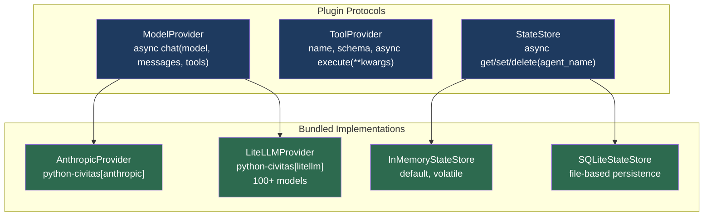

Any class that satisfies the protocol can be used — you don't subclass anything. To write a custom model provider:

```python
class MyProvider:
    async def chat(self, model, messages, tools=None):
        # call your API here
        return ModelResponse(content="...", model=model, tokens_in=0, tokens_out=0, cost_usd=0.0)

runtime = Runtime(
    supervisor=...,
    model_provider=MyProvider(),   # satisfies ModelProvider protocol
)
```

See [Plugins](plugins.md) for the full protocol definitions and all bundled implementations.

---

## Runtime

`Runtime` assembles all the components and manages the system lifecycle.

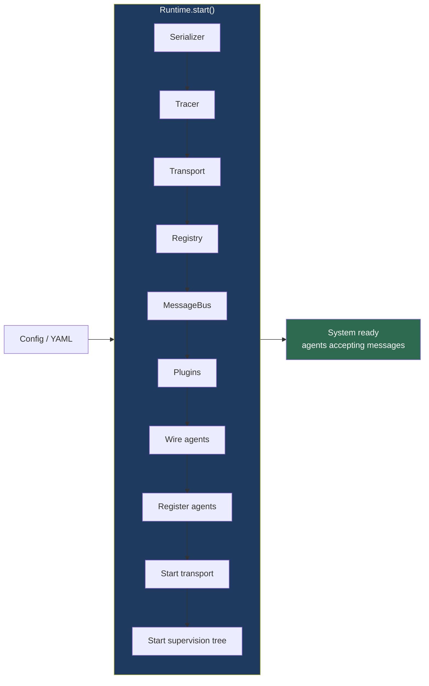

The startup sequence is deterministic: infrastructure first (serializer, tracer, transport, registry, bus), then plugins, then agents. Agents are never started before the bus is ready.

**Programmatic:**

```python
runtime = Runtime(
    supervisor=Supervisor("root", children=[...]),
    transport="in_process",          # or "zmq", "nats"
    model_provider=AnthropicProvider(),
    tool_registry=tools,
    state_store=SQLiteStateStore("state.db"),
)
await runtime.start()
# ...
await runtime.stop()
```

**From YAML topology:**

```python
runtime = Runtime.from_yaml("topology.yaml")
await runtime.start()
```

See [Topology YAML](topology.md) for the full schema.

---

## How the pieces fit together

A complete system, traced through one message:

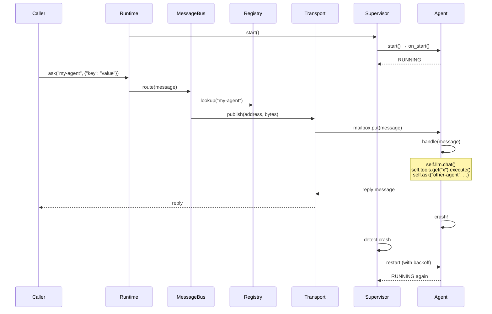

The caller never sees the crash. The supervisor handles it between messages.

---

## What Civitas does not do

**Civitas is not a framework.** It does not define how agents reason, what prompts they use, or how they chain LLM calls. Those decisions belong in your `handle()` method.

**Civitas does not replace LangGraph or CrewAI.** It wraps them. A LangGraph graph runs inside an `AgentProcess` via the [LangGraph adapter](adapters.md), gaining supervision and observability for free.

**Civitas does not manage container scheduling.** Level 4 deployment generates Docker Compose configuration. Kubernetes scheduling of those containers is outside scope — use node selectors and resource annotations for that.
