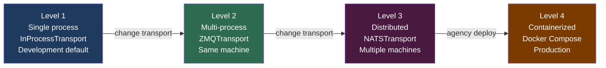
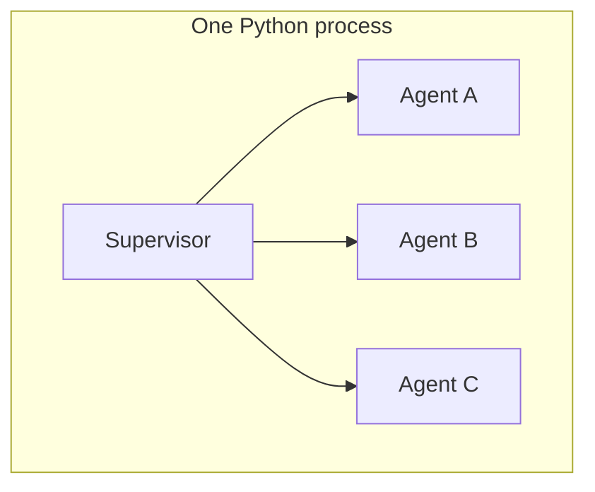
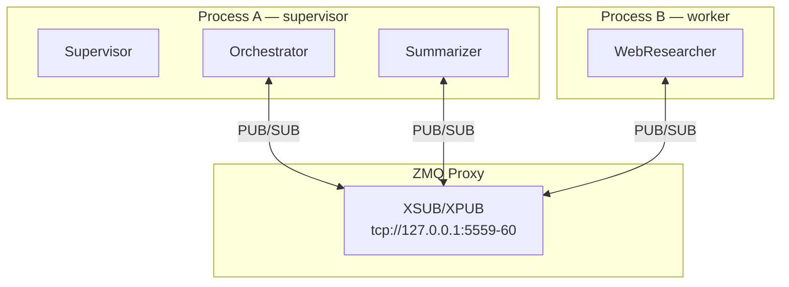
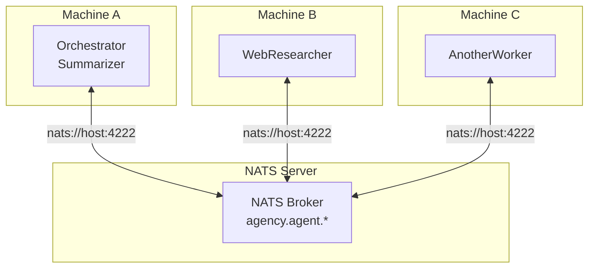

# Deployment

Agency uses a four-level deployment ladder. Every level runs the same agent code — only the transport and process topology change. Start at Level 1, graduate to higher levels as your scale or isolation requirements grow.

---

## The deployment ladder



---

## Level 1 — Single process

**Default. No extra dependencies. For development and simple single-machine deployments.**



All agents run as asyncio tasks inside one Python process. The `InProcessTransport` delivers messages via asyncio queues — fast (~2–5 µs per message), zero network overhead.

**Install:**

```bash
pip install python-agency
```

**topology.yaml:**

```yaml
transport:
  type: in_process

plugins:
  models:
    - type: anthropic
      config:
        default_model: claude-sonnet-4-6

supervision:
  name: root
  strategy: ONE_FOR_ONE
  children:
    - agent:
        name: orchestrator
        type: myapp.Orchestrator
    - agent:
        name: researcher
        type: myapp.Researcher
    - agent:
        name: summarizer
        type: myapp.Summarizer
```

**Run:**

```bash
agency run --topology topology.yaml
```

**When to use Level 1:**

- Development and testing
- Workloads that are I/O-bound (LLM calls, API calls) — the GIL doesn't matter
- Demos and quickstarts
- Any deployment where process isolation is not needed

---

## Level 2 — Multi-process (ZMQ)

**Scale beyond the GIL. Isolate agent processes on a single machine.**



Agents marked `process: worker` in the topology run in a separate OS process. The supervisor process starts a ZMQ XSUB/XPUB proxy; all other processes connect to it.

**Install:**

```bash
pip install python-agency[zmq]
```

**topology.yaml:**

```yaml
transport:
  type: zmq
  pub_addr: "tcp://127.0.0.1:5559"
  sub_addr: "tcp://127.0.0.1:5560"
  start_proxy: true

supervision:
  name: root
  strategy: ONE_FOR_ONE
  children:
    - agent:
        name: orchestrator
        type: myapp.Orchestrator
        # no process: — runs in the supervisor process

    - agent:
        name: researcher
        type: myapp.WebResearcher
        process: worker            # runs in a separate Worker process

    - agent:
        name: summarizer
        type: myapp.Summarizer
        process: worker
```

**Run:**

```bash
# Terminal 1 — supervisor process (also starts the ZMQ proxy)
agency run --topology topology.yaml

# Terminal 2 — worker process (connects to the proxy)
agency run --topology topology.yaml --process worker
```

Multiple agents can share the same `process:` name — they all run in one worker. Each distinct process name requires a separate `agency run --process <name>` invocation.

**When to use Level 2:**

- True CPU-bound agents that need to escape the GIL (image processing, local inference)
- GPU agents that require process-level memory isolation (TensorFlow/PyTorch)
- Crash isolation: a runaway agent in one process can't corrupt the memory of others
- Single-machine staging before moving to distributed

---

## Level 3 — Distributed (NATS)

**Run agents on multiple machines. Production scale.**



NATS replaces the ZMQ proxy with a cloud-native message broker. Every agent subscribes to its own NATS subject (`agency.agent.<name>`). The topology, supervision tree, and agent code are unchanged from Level 2.

**Install:**

```bash
pip install python-agency[nats]
```

**Start NATS:**

```bash
# Local development
docker run -d -p 4222:4222 -p 8222:8222 nats

# With JetStream (for at-least-once delivery)
docker run -d -p 4222:4222 -p 8222:8222 nats --jetstream
```

**topology.yaml:**

```yaml
transport:
  type: nats
  servers: "nats://localhost:4222"
  jetstream: false               # set true for at-least-once delivery

plugins:
  models:
    - type: anthropic
      config:
        default_model: claude-sonnet-4-6
        max_tokens: 8192
        max_retries: 3

  state:
    type: sqlite
    config:
      db_path: /data/agency_state.db

supervision:
  name: root
  strategy: ONE_FOR_ONE
  max_restarts: 3
  backoff: EXPONENTIAL
  backoff_base: 2.0
  children:
    - agent:
        name: orchestrator
        type: myapp.Orchestrator

    - agent:
        name: researcher
        type: myapp.WebResearcher
        process: worker

    - agent:
        name: summarizer
        type: myapp.Summarizer
```

**Run:**

```bash
# Machine A — supervisor
agency run --topology topology.yaml

# Machine B — worker (point --nats-url at your NATS host if it's not localhost)
agency run --topology topology.yaml --process worker --nats-url nats://nats-host:4222
```

**JetStream (durable subscriptions):**

With `jetstream: true`, agents use durable NATS subscriptions. Messages are persisted in the NATS server and redelivered if a subscriber disconnects. Use this when:

- Agents must not miss messages during a restart or brief network partition
- You need at-least-once delivery guarantees

For most workloads, at-most-once delivery with supervisor-level restart (the default) is sufficient and simpler to operate.

**When to use Level 3:**

- Agents that need to scale horizontally across machines
- Cloud deployments (Kubernetes pods, ECS tasks, GKE containers)
- High-availability requirements — run a NATS cluster for HA
- Geographic distribution of agent processes

---

## Level 4 — Containerized (Docker Compose)

**Generate a ready-to-run Docker Compose stack from your topology.**

```bash
agency deploy docker-compose --topology topology.yaml --output ./deploy
```

This reads your topology YAML, inspects the `process:` assignments, and generates:

- `Dockerfile` — builds an Agency image with the right transport extras
- `docker-compose.yml` — one service per process group (supervisor + one per worker name)
- `.env` — runtime environment variables with placeholders for secrets

```
  ✔ Generated deployment artifacts

    docker-compose.yml         supervisor + 2 workers
    Dockerfile                 agent image
    .env                       runtime config
    topology.yaml              topology (copied)

    4 agents across 3 containers

  Run with: cd deploy && docker compose up
```

**Example output for a NATS topology:**

```yaml
# docker-compose.yml (generated)
services:
  nats:
    image: nats:latest
    ports:
      - "4222:4222"
      - "8222:8222"
    command: --jetstream
    restart: unless-stopped
    healthcheck:
      test: ["CMD-SHELL", "wget -qO- http://localhost:8222/healthz || exit 1"]
      interval: 5s
      timeout: 3s
      retries: 3

  supervisor:
    build: .
    command: ["--topology", "topology.yaml"]
    volumes:
      - ./topology.yaml:/app/topology.yaml:ro
    restart: unless-stopped
    depends_on:
      nats:
        condition: service_healthy
    environment:
      AGENCY_SERIALIZER: ${AGENCY_SERIALIZER:-msgpack}
      NATS_URL: nats://nats:4222

  worker-worker:
    build: .
    command: ["--topology", "topology.yaml", "--process", "worker"]
    volumes:
      - ./topology.yaml:/app/topology.yaml:ro
    restart: unless-stopped
    depends_on:
      nats:
        condition: service_healthy
      supervisor:
        condition: service_started
    environment:
      AGENCY_SERIALIZER: ${AGENCY_SERIALIZER:-msgpack}
      NATS_URL: nats://nats:4222
```

**Deploy:**

```bash
cd deploy
# Set secrets in .env before starting
echo "ANTHROPIC_API_KEY=sk-ant-..." >> .env

docker compose up --build
```

**Scale workers horizontally:**

```bash
docker compose up --scale worker-worker=3
```

---

## Switching between levels

The same agent code runs at every level. Only the `transport:` block in your topology changes:

```yaml
# Level 1 — development
transport:
  type: in_process

# Level 2 — multi-process on one machine
transport:
  type: zmq
  pub_addr: "tcp://127.0.0.1:5559"
  sub_addr: "tcp://127.0.0.1:5560"
  start_proxy: true

# Level 3 — distributed, multiple machines
transport:
  type: nats
  servers: "nats://prod-nats:4222"
  jetstream: true
```

You can also override the transport at runtime without editing the file:

```bash
agency run --topology topology.yaml --transport nats --nats-url nats://prod:4222
```

---

## Environment variables

| Variable | Default | Description |
|---|---|---|
| `AGENCY_SERIALIZER` | `msgpack` | Message serializer: `msgpack` or `json` |
| `OTEL_EXPORTER_OTLP_ENDPOINT` | `None` | OTEL gRPC endpoint (e.g. `http://localhost:4317`). Unset = console output |
| `ANTHROPIC_API_KEY` | `None` | Anthropic API key — required when using `AnthropicProvider` |
| `OPENAI_API_KEY` | `None` | OpenAI key — required when using `LiteLLMProvider` with OpenAI models |
| `GEMINI_API_KEY` | `None` | Google Gemini key — required when using LiteLLM with Gemini |
| `NATS_URL` | `nats://localhost:4222` | NATS server URL — overrides `transport.servers` in topology |

Standard OTEL SDK variables (`OTEL_SERVICE_NAME`, `OTEL_RESOURCE_ATTRIBUTES`, etc.) are respected when `opentelemetry-sdk` is installed.

**Never put secrets in topology YAML.** The `ANTHROPIC_API_KEY` and other credentials are read from the environment automatically — no config key needed.

---

## Production checklist

**Transport**

- [ ] NATS is deployed with clustering for high availability
- [ ] `jetstream: true` enabled if at-least-once delivery is required
- [ ] `NATS_URL` is set in environment — not hardcoded in topology
- [ ] NATS monitoring endpoint is reachable (`http://nats-host:8222`)

**Supervision**

- [ ] `max_restarts` and `restart_window` tuned for expected failure rates
- [ ] `backoff: EXPONENTIAL` set on supervisors that talk to external services
- [ ] Critical agents (orchestrators, state managers) are at the root supervisor level

**State**

- [ ] `SQLiteStateStore` (or a custom durable store) configured — not `in_memory`
- [ ] `db_path` points to a persistent volume (not a container ephemeral filesystem)
- [ ] State CLI commands tested: `agency state list`, `agency state show <name>`

**Observability**

- [ ] `OTEL_EXPORTER_OTLP_ENDPOINT` set and validated against a real backend
- [ ] `OTEL_SERVICE_NAME` set to identify this deployment in the trace backend
- [ ] Cost attribution verified: LLM spans carry `llm.cost_usd`
- [ ] Supervisor restart spans visible in trace backend

**Secrets**

- [ ] All API keys are in environment or secret manager — not in topology files
- [ ] `.env` file is in `.gitignore`
- [ ] Docker secrets or Kubernetes Secrets used in container deployments

**Operations**

- [ ] `agency topology validate topology.yaml` passes in CI
- [ ] `docker compose up --scale worker-worker=N` tested for horizontal scale
- [ ] Graceful shutdown tested: `SIGTERM` → `runtime.stop()` → spans flushed
- [ ] Health check endpoint or NATS monitoring is wired to your load balancer or orchestrator

---

## Upgrading between levels

**Level 1 → Level 2:** Install `python-agency[zmq]`. Change `transport.type` to `zmq`. Add `process: worker` to agents you want isolated. Start a second terminal with `--process worker`. Agent code: unchanged.

**Level 2 → Level 3:** Install `python-agency[nats]`. Start a NATS server. Change `transport.type` to `nats`, set `servers`. Run each process group on its own machine (or container). Agent code: unchanged.

**Level 3 → Level 4:** Run `agency deploy docker-compose --topology topology.yaml`. Edit the generated `.env` with real secrets. Run `docker compose up --build`. Agent code: unchanged.
