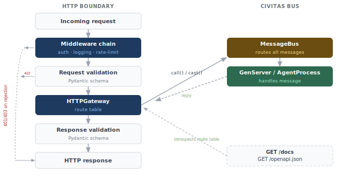

# Design: Gateway API Surface

**Status:** Implemented — v0.4
**Author:** Jeryn Mathew Varghese
**Last updated:** 2026-04

---

## Motivation

`HTTPGateway` provides the network bridge between external HTTP clients and the Civitas message bus. Out of the box it supports default URL conventions (`POST /agents/{name}`) — enough for internal tooling and simple integrations.

Production agentic APIs need a small but well-defined integration surface on top of that:

- **Routes** — clean, versioned URLs decoupled from agent names
- **Validation** — structured request/response contracts with automatic error responses
- **Middleware** — auth, logging, rate-limiting, without modifying agent code
- **OpenAPI docs** — auto-generated from agent contracts, zero extra writing

This spec defines that surface. The design principle is the same as `HTTPGateway` itself: the agent never sees HTTP. All HTTP concerns live at the gateway boundary.

---

## Architecture



The agent only ever sees a `Message`. The gateway owns every HTTP concept — method, status code, headers, validation errors, OpenAPI schema.

---

## Routes

Routes map an HTTP method + path to a named agent and a call mode (`call` for synchronous request-reply, `cast` for fire-and-forget).

### Decorator (colocated with handler)

```python
from civitas.gateway import route

class AssistantAgent(GenServer):

    @route("POST", "/v1/chat")
    async def handle_call(self, message: Message) -> Message | None:
        """Chat with the assistant."""
        ...

    @route("POST", "/v1/notify", mode="cast")
    async def handle_cast(self, message: Message) -> None:
        """Send a notification (fire-and-forget)."""
        ...
```

### Topology YAML (topology-first)

```yaml
- name: api
  type: http_gateway
  config:
    routes:
      - path: /v1/chat
        agent: assistant
        method: POST
        mode: call
      - path: /v1/notify
        agent: assistant
        method: POST
        mode: cast
      - path: /v1/status
        agent: assistant
        method: GET
        mode: call
```

### Path parameters

Path segments are extracted and merged into `message.payload`:

```python
@route("GET", "/v1/sessions/{session_id}/history")
async def handle_call(self, message: Message) -> Message | None:
    session_id = message.payload["session_id"]   # extracted from path
    ...
```

### Default routes (no config needed)

When no custom routes are defined, the gateway falls back to the default URL convention:

```
POST   /agents/{name}         →  call(name, body)
POST   /agents/{name}/cast    →  cast(name, body)
GET    /agents/{name}/state   →  call(name, {__op__: "state"})
POST   /broadcast             →  broadcast(body)
```

---

## Validation

Contracts are declared with Pydantic models. The `@contract` decorator binds a request model and an optional response model to a route.

```python
from pydantic import BaseModel, Field
from civitas.gateway import route, contract

class ChatRequest(BaseModel):
    message: str = Field(..., description="The user's message", min_length=1)
    session_id: str | None = Field(None, description="Session ID for conversation continuity")

class ChatResponse(BaseModel):
    reply: str = Field(..., description="The assistant's response")
    tokens_used: int = Field(..., description="Total tokens consumed")
    session_id: str = Field(..., description="Session ID (created if not provided)")

class AssistantAgent(GenServer):

    @route("POST", "/v1/chat")
    @contract(request=ChatRequest, response=ChatResponse)
    async def handle_call(self, message: Message) -> Message | None:
        body = ChatRequest.model_validate(message.payload)
        # ... agent logic ...
        return self.reply(
            ChatResponse(
                reply="...",
                tokens_used=120,
                session_id=body.session_id or new_session_id(),
            ).model_dump()
        )
```

### Validation behaviour

| Scenario | HTTP status | Body |
|----------|-------------|------|
| Request body invalid against schema | 422 | `{"detail": [{"loc": [...], "msg": "...", "type": "..."}]}` |
| Missing required field | 422 | Same as above |
| Reply payload invalid against response schema | 500 | `{"error": "internal: response validation failed"}` |
| No schema declared | — | Pass-through (no validation) |

422 error shape matches FastAPI exactly — clients written against FastAPI can migrate to Civitas without changing their error handling.

### Schema via YAML

For teams that prefer keeping schemas out of agent code:

```yaml
routes:
  - path: /v1/chat
    agent: assistant
    method: POST
    mode: call
    schema:
      request: myapp.schemas.ChatRequest
      response: myapp.schemas.ChatResponse
```

---

## Middleware

Middleware intercepts requests before they reach the route handler. Two forms are supported: stateless async functions and stateful GenServer middleware.

### Stateless middleware (async functions)

```python
from civitas.gateway import GatewayRequest, GatewayResponse, NextMiddleware
from civitas.config import settings

async def require_api_key(
    request: GatewayRequest,
    call_next: NextMiddleware,
) -> GatewayResponse:
    if request.headers.get("X-API-Key") != settings.api_key.get():
        return GatewayResponse(status=401, body={"error": "invalid API key"})
    return await call_next(request)

async def log_requests(
    request: GatewayRequest,
    call_next: NextMiddleware,
) -> GatewayResponse:
    response = await call_next(request)
    logger.info("%s %s → %d", request.method, request.path, response.status)
    return response
```

### Stateful middleware (GenServer)

For middleware that needs shared state — rate limiters, session stores, token counters — declare a GenServer child and call it from a thin async wrapper:

```python
class RateLimiter(GenServer):
    """Sliding-window rate limiter: max_requests per window_seconds per client."""

    def __init__(self, name: str, max_requests: int = 100, window_seconds: int = 60):
        super().__init__(name)
        self._max = max_requests
        self._window = window_seconds
        self._counts: dict[str, list[float]] = {}

    async def handle_call(self, message: Message) -> Message | None:
        client_id = message.payload["client_id"]
        allowed = self._check_and_increment(client_id)
        return self.reply({"allowed": allowed, "remaining": self._remaining(client_id)})

    def _check_and_increment(self, client_id: str) -> bool: ...
    def _remaining(self, client_id: str) -> int: ...
```

```python
async def rate_limit(request: GatewayRequest, call_next: NextMiddleware) -> GatewayResponse:
    result = await request.gateway.call("rate_limiter", {"client_id": request.client_ip})
    if not result.payload["allowed"]:
        return GatewayResponse(
            status=429,
            headers={"Retry-After": "60"},
            body={"error": "rate limit exceeded"},
        )
    return await call_next(request)
```

### Middleware registration

Global middleware applies to all routes. Route-scoped middleware applies only to that route and runs after global middleware.

```yaml
- name: api
  type: http_gateway
  config:
    middleware:
      - myapp.middleware.log_requests        # global, runs first
      - myapp.middleware.require_api_key     # global
    routes:
      - path: /v1/chat
        agent: assistant
        method: POST
        mode: call
        middleware:
          - myapp.middleware.rate_limit      # route-scoped, runs after global
```

### Execution order

```
global middleware[0] → global middleware[1] → ... → route middleware[0] → ... → validation → bus
```

A middleware that returns a response without calling `call_next` short-circuits the chain.

---

## OpenAPI docs

The gateway introspects the route table and `@contract` schemas at startup and generates a complete OpenAPI 3.1 spec. No extra code required.

```
GET /openapi.json   →  OpenAPI 3.1 spec (JSON)
GET /docs           →  Swagger UI
GET /redoc          →  ReDoc UI
```

### What gets auto-generated

- **Paths** — from the route table (method, path, operation ID)
- **Request body schema** — from the Pydantic `request` model in `@contract`
- **Response schema** — from the Pydantic `response` model in `@contract`
- **Operation summary** — from the handler method's docstring (first line)
- **Operation description** — from the full docstring
- **Tags** — from the agent name (all routes on `assistant` are tagged `assistant`)
- **422 response** — auto-included whenever a request schema is declared

### Enriching the spec

```python
class ChatRequest(BaseModel):
    message: str = Field(..., description="The user's message", examples=["What is Civitas?"])
    session_id: str | None = Field(None, description="Session ID for continuity")

class AssistantAgent(GenServer):

    @route("POST", "/v1/chat")
    @contract(request=ChatRequest, response=ChatResponse)
    async def handle_call(self, message: Message) -> Message | None:
        """Chat with the assistant.

        Sends a message to the assistant and returns a reply.
        Maintains session context when session_id is provided.
        """
        ...
```

Results in:

```json
{
  "paths": {
    "/v1/chat": {
      "post": {
        "summary": "Chat with the assistant.",
        "description": "Sends a message to the assistant and returns a reply.\nMaintains session context when session_id is provided.",
        "tags": ["assistant"],
        "requestBody": { ... },
        "responses": {
          "200": { ... },
          "422": { "$ref": "#/components/responses/ValidationError" }
        }
      }
    }
  }
}
```

### Disabling docs

```yaml
- name: api
  type: http_gateway
  config:
    docs:
      enabled: false        # disable entirely (production hardening)
      # or:
      path: /internal/docs  # serve at a non-default path
```

---

## GatewayRequest / GatewayResponse types

The middleware API exposes a thin request/response abstraction — not a full ASGI scope, not an HTTP framework object:

```python
@dataclass
class GatewayRequest:
    method: str                        # "GET", "POST", etc.
    path: str                          # "/v1/chat"
    path_params: dict[str, str]        # {"session_id": "abc123"}
    query_params: dict[str, str]       # {"limit": "10"}
    headers: dict[str, str]            # lowercased header names
    body: dict                         # parsed JSON body
    client_ip: str
    gateway: AgentProcess              # reference to the gateway (for calling other agents)

@dataclass
class GatewayResponse:
    status: int = 200
    body: dict = field(default_factory=dict)
    headers: dict[str, str] = field(default_factory=dict)
```

---

## Full example

A complete agentic API with auth, rate-limiting, validation, and auto-generated docs:

```python
# myapp/agents.py
from pydantic import BaseModel, Field
from civitas import GenServer
from civitas.gateway import route, contract
from civitas.messages import Message

class ChatRequest(BaseModel):
    message: str = Field(..., min_length=1)
    session_id: str | None = None

class ChatResponse(BaseModel):
    reply: str
    tokens_used: int
    session_id: str

class AssistantAgent(GenServer):

    @route("POST", "/v1/chat")
    @contract(request=ChatRequest, response=ChatResponse)
    async def handle_call(self, message: Message) -> Message | None:
        """Chat with the assistant."""
        body = ChatRequest.model_validate(message.payload)
        reply = await self.llm.chat(...)
        return self.reply(ChatResponse(...).model_dump())
```

```yaml
# topology.yaml
supervision:
  name: root
  strategy: ONE_FOR_ONE
  children:
    - name: api
      type: http_gateway
      config:
        host: "0.0.0.0"
        port: 8080
        middleware:
          - myapp.middleware.require_api_key
          - myapp.middleware.log_requests
        routes:
          - path: /v1/chat
            agent: assistant
            method: POST
            mode: call
            middleware:
              - myapp.middleware.rate_limit

    - name: rate_limiter
      type: gen_server
      module: myapp.middleware
      class: RateLimiter
      config:
        max_requests: 100
        window_seconds: 60

    - name: assistant
      type: gen_server
      module: myapp.agents
      class: AssistantAgent
```

```bash
civitas run --topology topology.yaml
# API live at http://0.0.0.0:8080
# Docs at    http://0.0.0.0:8080/docs
```

---

## Implementation plan

### Phase 1 — Routes + validation (v0.4, with HTTPGateway)

1. `civitas/gateway/routing.py` — `RouteTable`, `@route` decorator, path parameter extraction
2. `civitas/gateway/contracts.py` — `@contract` decorator, request/response Pydantic validation, 422 error formatting
3. `civitas/gateway/types.py` — `GatewayRequest`, `GatewayResponse`, `NextMiddleware`
4. Wire route table into `asgi.py` request dispatch loop

### Phase 2 — Middleware (v0.4)

1. `civitas/gateway/middleware.py` — middleware chain runner, global + route-scoped registration
2. YAML middleware loading (dotted path → callable)
3. `gateway` reference on `GatewayRequest` for stateful GenServer middleware

### Phase 3 — OpenAPI (v0.4)

1. `civitas/gateway/openapi.py` — spec builder: introspects route table + contracts
2. `/openapi.json`, `/docs` (Swagger UI via CDN), `/redoc` endpoints
3. Docstring → summary/description extraction
4. `docs.enabled` / `docs.path` config options

---

## What this is NOT

- **No template rendering** — Civitas serves APIs, not HTML pages
- **No ORM integration** — data access lives in GenServers, not in the gateway
- **No session management built-in** — implement as a GenServer middleware if needed
- **No file uploads** — multipart/form-data is out of scope for v0.4; add as a future extension

---

## Dependencies

No new dependencies beyond what `HTTPGateway` already requires. OpenAPI spec generation uses `pydantic`'s built-in `model_json_schema()` — no additional library needed.

Swagger UI and ReDoc are served from their respective CDNs (no static asset bundling required).

---

## Open questions

| # | Question | Notes |
|---|----------|-------|
| Q1 | Should `@route` be on the GenServer method or declared separately on the gateway? | Method decorator keeps contract colocated with handler — prefer this |
| Q2 | How does the gateway discover `@route` decorators on agents it doesn't import directly? | Gateway reads route table from `topology.yaml`; decorators register at class definition time via a module-level registry |
| Q3 | Should middleware be async-only or support sync functions too? | Async-only — avoids `run_in_executor` overhead; sync middleware is a footgun in an async runtime |
| Q4 | How should streaming responses (SSE, chunked) work? | Out of scope for v0.4 — agent returns `{"chunks": [...]}` and gateway serialises; true streaming deferred |
| Q5 | Should OpenAPI docs be disabled by default in production? | No — leave on by default, document how to disable; many teams want docs in staging/prod |

---

## Acceptance criteria

- [ ] `@route` decorator maps a GenServer method to an HTTP method + path
- [ ] Path parameters extracted and available in `message.payload`
- [ ] `@contract` validates request body against Pydantic model; returns 422 on failure with FastAPI-compatible error shape
- [ ] `@contract` validates response payload; returns 500 on mismatch
- [ ] Global middleware runs before all routes
- [ ] Route-scoped middleware runs after global, before validation
- [ ] Middleware returning a response without calling `call_next` short-circuits the chain
- [ ] Stateful GenServer middleware callable via `request.gateway.call()`
- [ ] `GET /openapi.json` returns valid OpenAPI 3.1 spec
- [ ] `GET /docs` serves Swagger UI populated from the spec
- [ ] Operation summaries populated from handler docstrings
- [ ] Tags populated from agent names
- [ ] `docs.enabled: false` disables all doc endpoints
- [ ] YAML-declared routes and schemas work without `@route` / `@contract` decorators
- [ ] ≥ 15 unit tests (route matching, validation, middleware chain, OpenAPI generation)
- [ ] ≥ 3 integration tests (real HTTP client through full stack)
