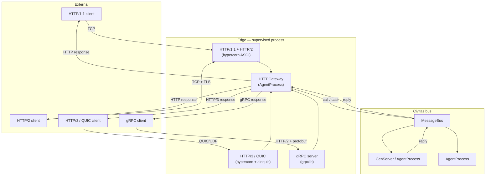

# Design: HTTPGateway

**Status:** Planned — v0.4
**Author:** Jeryn Mathew Varghese
**Last updated:** 2026-04

---

## Motivation

Civitas agents communicate exclusively through the message bus. External clients — mobile apps, browsers, microservices, CLI tools — speak HTTP, HTTP/2, HTTP/3, or gRPC. Without a bridge, every integration requires custom glue code outside the supervision tree.

`HTTPGateway` is a supervised `AgentProcess` (or `GenServer`) that binds to a port, translates inbound protocol traffic into Civitas messages, routes them to the appropriate agent or GenServer, and returns the reply as a protocol response. The agent handling the request has no knowledge of HTTP — it only sees `call()` / `cast()` messages, exactly as if another agent sent them.

**What this is not:** a full application framework. `HTTPGateway` is a thin, protocol-aware edge process in the supervision tree. Business logic lives in agents and GenServers behind it.

---

## Protocol support matrix

| Protocol | Transport | Multiplexing | TLS | Civitas mapping |
|----------|-----------|-------------|-----|-----------------|
| HTTP/1.1 | TCP | No (keep-alive only) | Optional | `call` / `cast` |
| HTTP/2 | TCP | Yes (streams) | Required (ALPN) | `call` / `cast` / server-push |
| HTTP/3 | QUIC (UDP) | Yes (streams, 0-RTT) | Built-in | `call` / `cast` |
| gRPC | HTTP/2 | Yes | Optional (insecure mode) | Unary → `call`, streaming → `cast` chain |

All four share the same routing and message-translation layer. Only the network I/O layer differs.

---

## Architecture



`HTTPGateway` is started as a child of any `Supervisor`. It owns the three server coroutines internally and manages their lifecycle within its `on_start` / `on_stop` hooks.

---

## Request-to-message mapping

### URL routing convention

```
POST   /agents/{name}         →  call(name, body)       # synchronous, returns reply
POST   /agents/{name}/cast    →  cast(name, body)        # fire-and-forget, returns 202
GET    /agents/{name}/state   →  call(name, {__op__: state})
POST   /broadcast             →  broadcast(body)
```

Custom route tables are supported via topology YAML (see below).

### HTTP → Message translation

| HTTP concept | Civitas Message field |
|-------------|----------------------|
| URL path segment `{name}` | `recipient` |
| Request body (JSON) | `payload` |
| `X-Civitas-Type` header | `type` (defaults to `"http.request"`) |
| `X-Correlation-ID` header | `correlation_id` |
| `traceparent` header (W3C) | `trace_id`, `parent_span_id` |
| HTTP method | determines `call` vs `cast` (POST=call, PUT=cast) |

### Message → HTTP response translation

| Message reply field | HTTP concept |
|--------------------|--------------|
| `payload` (dict) | JSON response body |
| `payload.error` present | HTTP 400 |
| No handler registered | HTTP 404 |
| Timeout | HTTP 504 |
| Unhandled exception | HTTP 500 |

---

## HTTP/1.1 and HTTP/2

**Server:** [Hypercorn](https://hypercorn.readthedocs.io) — ASGI server supporting HTTP/1.1 and HTTP/2 with a single codebase. Hypercorn negotiates HTTP/2 via ALPN on TLS connections transparently.

**Interface:** Standard ASGI app. `HTTPGateway` implements `__call__(scope, receive, send)` internally, wrapping Hypercorn.

```python
from civitas.gateway import HTTPGateway

gateway = HTTPGateway(
    name="api",
    host="0.0.0.0",
    port=8080,
    tls_cert="certs/server.crt",   # enables HTTP/2 via ALPN
    tls_key="certs/server.key",
    request_timeout=30.0,
)
```

**HTTP/2 specifics:**
- Stream multiplexing is handled by Hypercorn — each stream maps to one Civitas `call()`
- Server push is not exposed in v1 (deferred — requires explicit push directives from agents)
- `h2` package required: `pip install civitas[http2]`

---

## HTTP/3 / QUIC

**Server:** Hypercorn with [aioquic](https://github.com/aioquic/aioquic) backend.

HTTP/3 runs over QUIC — a multiplexed, encrypted transport over UDP. Key benefits over HTTP/2:
- **0-RTT connection resumption** — repeat clients connect with zero round-trip handshake
- **Head-of-line blocking eliminated** — lost UDP packets don't stall other streams
- **Connection migration** — clients can change IP (mobile handoff) without reconnecting

**QUIC requires TLS** — there is no plaintext QUIC. Certificate required.

```python
gateway = HTTPGateway(
    name="api",
    host="0.0.0.0",
    port=8080,
    port_quic=8443,                 # separate UDP port for QUIC
    tls_cert="certs/server.crt",
    tls_key="certs/server.key",
    enable_http3=True,              # adds Alt-Svc header to HTTP/1.1 and HTTP/2 responses
)
```

The `Alt-Svc: h3=":8443"` header is automatically injected into HTTP/1.1 and HTTP/2 responses, advertising the QUIC endpoint to clients that support it.

**Required extra:** `pip install civitas[http3]` (installs `hypercorn[h3]` + `aioquic`)

---

## gRPC

**Server:** [grpclib](https://github.com/vmagamedov/grpclib) — pure Python async gRPC, no C extension required.

gRPC uses HTTP/2 as transport and Protocol Buffers (protobuf) as the serialization format. Civitas exposes a **generic reflection service** so clients don't need pre-generated stubs for basic use:

### Generic service (no proto required)

```protobuf
// Automatically served by HTTPGateway
service CivitasGateway {
    rpc Call(Request) returns (Response);         // → call()
    rpc Cast(Request) returns (google.protobuf.Empty); // → cast()
    rpc Stream(Request) returns (stream Response); // → call() + stream reply chunks
}

message Request {
    string recipient = 1;
    string type = 2;
    bytes  payload_json = 3;    // JSON-encoded payload
    string correlation_id = 4;
    string trace_parent = 5;
}

message Response {
    bytes  payload_json = 1;
    string error = 2;
}
```

### RPC → Civitas mapping

| gRPC RPC type | Civitas operation | Notes |
|--------------|------------------|-------|
| Unary | `call()` | One request, one reply |
| Client streaming | Accumulate → `call()` | All client frames collected, then one call |
| Server streaming | `call()` → stream chunks | Agent returns `{"chunks": [...]}` |
| Bidirectional streaming | `cast()` per frame | No correlation; fire-and-forget per message |

### Custom proto stubs (optional)

For typed APIs, agents can expose a `.proto` definition. The gateway loads it at startup and maps each RPC method to a Civitas agent name:

```yaml
# topology.yaml
gateway:
  grpc:
    proto_dir: protos/
    services:
      - proto: protos/assistant.proto
        service: AssistantService
        agent: assistant          # routes all RPCs to this agent name
```

**Required extra:** `pip install civitas[grpc]` (installs `grpclib` + `protobuf`)

---

## Topology YAML

```yaml
supervision:
  name: root
  strategy: ONE_FOR_ONE
  children:
    - name: api
      type: http_gateway
      module: civitas.gateway
      class: HTTPGateway
      config:
        host: "0.0.0.0"
        port: 8080
        port_quic: 8443
        enable_http3: true
        tls_cert: !ENV GATEWAY_TLS_CERT
        tls_key: !ENV GATEWAY_TLS_KEY
        request_timeout: 30.0
        grpc:
          enabled: true
          proto_dir: protos/
        routes:
          - path: /v1/chat
            agent: assistant
            method: POST
            mode: call
          - path: /v1/notify
            agent: notifier
            method: POST
            mode: cast

    - name: assistant
      type: agent
      module: myapp.agents
      class: AssistantAgent

    - name: notifier
      type: gen_server
      module: myapp.services
      class: NotifierService
```

---

## Implementation plan

### Phase 1 — HTTP/1.1 + HTTP/2 (ship with GenServer, v0.4)

1. `civitas/gateway/__init__.py` — `HTTPGateway(AgentProcess)`
2. `civitas/gateway/asgi.py` — ASGI app, request translation, response mapping
3. `civitas/gateway/router.py` — route table (path → agent name, mode)
4. Hypercorn runner inside `on_start()` / `on_stop()`
5. TLS config from `settings` or topology YAML
6. `civitas[http]` extra: `hypercorn>=0.17`

### Phase 2 — HTTP/3 / QUIC (v0.4)

1. Add `port_quic` config option to `HTTPGateway`
2. Enable Hypercorn QUIC backend when `enable_http3=True`
3. Auto-inject `Alt-Svc` header
4. `civitas[http3]` extra: `hypercorn[h3]>=0.17`, `aioquic>=1.0`

### Phase 3 — gRPC (v0.5)

1. `civitas/gateway/grpc.py` — generic `CivitasGateway` service via grpclib
2. `.proto` file bundled with the package
3. Optional custom proto loading from `proto_dir`
4. RPC → message type mapping (unary, client-streaming, server-streaming, bidirectional)
5. `civitas[grpc]` extra: `grpclib>=0.4`, `protobuf>=4`

### Phase 4 — Advanced (v0.5+)

- gRPC reflection service (clients can introspect available services without .proto files)
- HTTP/2 server push
- WebSocket upgrade (maps to long-lived `cast()` sessions)
- Rate limiting via `RateLimiter` GenServer (built-in integration)
- Request authentication middleware (JWT, API key, mTLS client certs)

---

## What HTTPGateway does NOT do

- **No business logic** — it translates and routes. All logic lives in agents/GenServers.
- **No load balancing** — route to one agent by name. Load balancing is a supervisor/registry concern.
- **No request queuing** — requests that exceed `request_timeout` return 504. Queuing is the agent's responsibility.
- **No schema validation** — payloads are forwarded as-is. Validation belongs in `handle_call()`.

---

## Dependencies summary

| Extra | Installs | Enables |
|-------|----------|---------|
| `civitas[http]` | `hypercorn>=0.17` | HTTP/1.1 + HTTP/2 |
| `civitas[http3]` | `hypercorn[h3]>=0.17`, `aioquic>=1.0` | HTTP/3 / QUIC |
| `civitas[grpc]` | `grpclib>=0.4`, `protobuf>=4` | gRPC |

All three can be installed together: `pip install civitas[http,http3,grpc]`

---

## Open questions

| # | Question | Notes |
|---|----------|-------|
| Q1 | Should `HTTPGateway` be a `GenServer` subclass or `AgentProcess`? | Lean `AgentProcess` — it uses `self.call()` / `self.cast()` on the bus, not `handle_call` itself |
| Q2 | How should streaming gRPC map to the bus? | `cast()` per frame is simplest; bidirectional may need a dedicated session agent |
| Q3 | Should the generic gRPC service use JSON or msgpack for `payload`? | JSON — maximises client interoperability without requiring Civitas SDK |
| Q4 | TLS termination — in-process or via sidecar (Envoy, nginx)? | Both; in-process for simplicity, sidecar for production mTLS |
| Q5 | How do WebSocket upgrades map to the bus? | Long-lived session — each WebSocket frame → `cast()`; close event → `call()` teardown |
| Q6 | Should route tables support middleware chains (auth, rate-limit, logging)? | Yes, via pluggable middleware list in topology YAML — spec separately |

---

## Acceptance criteria

- [ ] `HTTPGateway` starts as a child of any `Supervisor`
- [ ] HTTP/1.1 requests route correctly to named agents via `call()` and `cast()`
- [ ] HTTP/2 multiplexed streams each map to independent Civitas calls
- [ ] HTTP/3 QUIC endpoint advertised via `Alt-Svc` header
- [ ] gRPC unary RPC maps to `call()` and returns correct protobuf response
- [ ] `request_timeout` returns HTTP 504 / gRPC DEADLINE_EXCEEDED
- [ ] TLS config loaded from `settings` / topology YAML / env vars
- [ ] `HTTPGateway` stops cleanly on `Supervisor` shutdown — drains in-flight requests
- [ ] Topology YAML `type: http_gateway` supported by `civitas topology validate`
- [ ] `civitas topology show` displays gateway nodes with protocol annotations
- [ ] ≥ 20 unit tests (routing, translation, timeout, error mapping)
- [ ] ≥ 5 integration tests (real HTTP client → gateway → agent → response)
- [ ] Documented with examples for all four protocols
