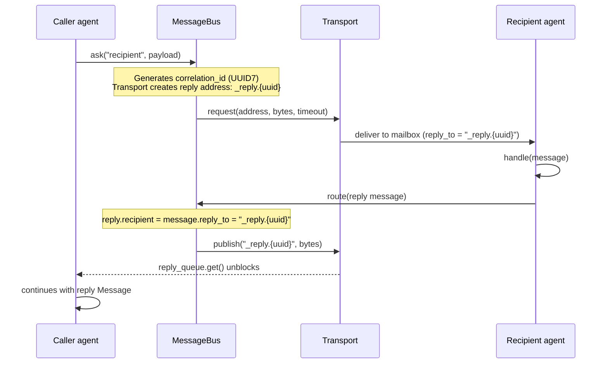
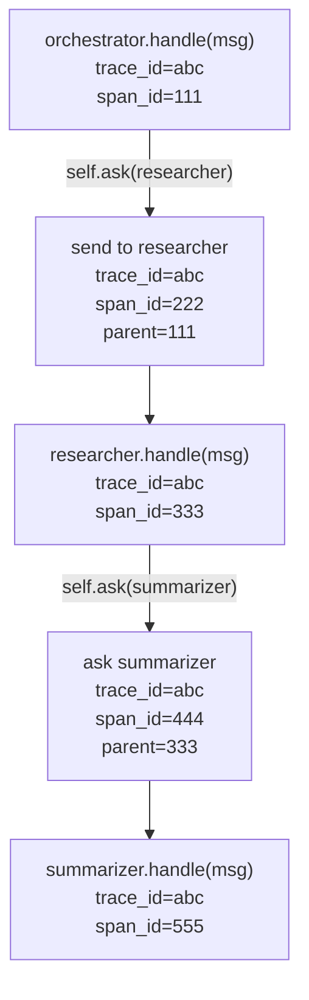
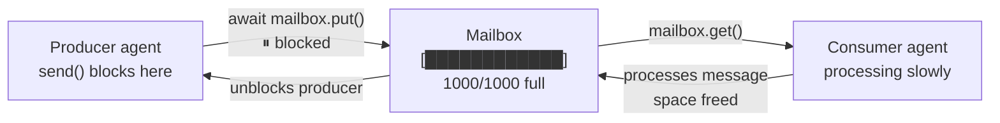
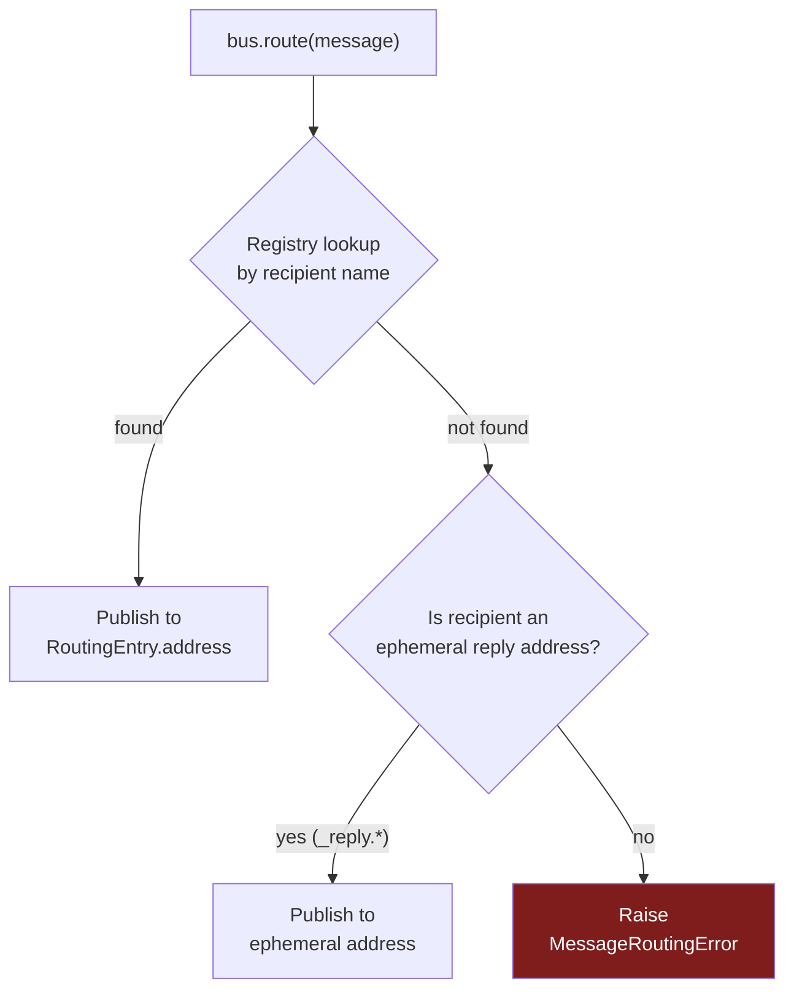

# Messaging

Agents communicate exclusively through message passing — there are no shared objects, no direct method calls between agents. This document covers every messaging primitive, how routing works under the hood, backpressure, trace propagation, and common patterns.

---

## The three primitives

| Method | Direction | Awaits reply? | Use when |
|---|---|---|---|
| `self.send(name, payload)` | caller → recipient | No | Notify, trigger, emit events |
| `self.ask(name, payload)` | caller → recipient → caller | Yes | Need a result back |
| `self.broadcast(pattern, payload)` | caller → all matching | No | Fanout to a group |

All three are async, all three are available inside `handle()`, `on_start()`, and `on_stop()`.

---

## send — fire-and-forget

```python
async def handle(self, message: Message) -> Message | None:
    # Notify another agent and continue immediately
    await self.send("logger", {"event": "task_started", "task_id": message.payload["id"]})
    await self.send("metrics", {"counter": "messages_processed"})
    return self.reply({"ok": True})
```

`send` returns as soon as the message is placed in the recipient's mailbox — it does not wait for the recipient to process it. If the recipient's mailbox is full, `send` blocks until space is available (backpressure — see below).

**Optional `message_type` parameter:**

```python
await self.send("coordinator", {"status": "ready"}, message_type="worker.ready")
```

The `type` field on the `Message` is application-defined. It flows through to the recipient's `handle()` as `message.type`, and it appears in OTEL spans. Use it to distinguish different message kinds arriving at the same agent.

---

## ask — request-reply

```python
async def handle(self, message: Message) -> Message | None:
    # Send and wait for a reply (default timeout: 30s)
    result = await self.ask("researcher", {"query": message.payload["topic"]})
    summary = await self.ask("summarizer", {"text": result.payload["findings"]})
    return self.reply({"report": summary.payload["summary"]})
```

`ask` suspends the calling agent until the recipient calls `self.reply(...)`, or until the timeout expires. While suspended, the calling agent's mailbox continues to accept new messages — only this particular `handle()` invocation is waiting.

**Timeout:**

```python
result = await self.ask("slow_service", {"work": "..."}, timeout=60.0)
```

Default is 30 seconds. If the timeout expires, `asyncio.TimeoutError` is raised. Handle it in `on_error()` or inline:

```python
try:
    result = await self.ask("service", payload, timeout=5.0)
except TimeoutError:
    return self.reply({"error": "service unavailable"})
```

### How request-reply works under the hood



Key points:
- The transport creates a UUID-keyed ephemeral reply address per request (`_reply.{uuid7}`)
- The reply address is injected into the request message as `message.reply_to`
- When the recipient calls `self.reply(...)`, the runtime routes to that ephemeral address
- The ephemeral address is cleaned up after the reply is received or the timeout expires
- No sockets or ports are allocated per request — just a dict key in the transport

---

## reply — responding from handle()

`self.reply(payload)` creates a properly wired reply `Message`. **Return it from `handle()`** — do not call `self.send()` with the reply payload directly.

```python
async def handle(self, message: Message) -> Message | None:
    result = expensive_computation(message.payload["input"])
    return self.reply({"result": result})   # correct
```

`reply()` copies the `correlation_id`, `trace_id`, and sets `recipient` to `message.reply_to`. This is what connects the reply to the caller's waiting `ask()`.

**For fire-and-forget messages:** return `None` (or just `return`) from `handle()`. If a caller sent with `send()`, there is no `reply_to` and no one is waiting — returning a reply would cause a routing error.

```python
async def handle(self, message: Message) -> Message | None:
    if message.type == "notify":
        process_notification(message.payload)
        return None   # no reply needed
    return self.reply({"processed": True})
```

---

## broadcast — fanout to a group

```python
async def handle(self, message: Message) -> Message | None:
    # Send to all agents whose name matches the glob
    await self.broadcast("workers.*", {"task": message.payload["task"]})
    await self.broadcast("cache.*", {"invalidate": True})
```

`broadcast` uses glob pattern matching (`fnmatch`) against all registered agent names. It is fire-and-forget to each recipient — there is no way to collect replies from a broadcast. For fanout-with-collection, use parallel `ask()` calls instead (see patterns below).

**Glob examples:**

| Pattern | Matches |
|---|---|
| `"workers.*"` | `workers.a`, `workers.b`, `workers.gpu-1` |
| `"*.cache"` | `redis.cache`, `local.cache` |
| `"agent-?"` | `agent-1`, `agent-2` (single char wildcard) |
| `"*"` | Every registered agent |

---

## The Message envelope

Every message — whether created by `send`, `ask`, or `reply` — is wrapped in the same `Message` dataclass:

```python
@dataclass
class Message:
    # Identity
    id: str               # UUID7 — time-sortable, globally unique
    type: str             # application-defined (default: "message")

    # Routing
    sender: str           # name of the sending agent
    recipient: str        # name of the target agent
    correlation_id: str | None   # links reply → originating ask()
    reply_to: str | None         # ephemeral address for the reply

    # Your data
    payload: dict         # must contain only JSON-serializable values

    # Observability
    trace_id: str                # distributed trace identifier
    span_id: str                 # this message's own span ID
    parent_span_id: str | None   # span that caused this message

    # Runtime
    timestamp: float      # unix timestamp at creation
    attempt: int          # incremented on RETRY (starts at 0)
    priority: int         # > 0 means system message (jumps the queue)
```

Inside `handle()`, the full envelope is available:

```python
async def handle(self, message: Message) -> Message | None:
    print(message.id)             # unique ID of this message
    print(message.type)           # e.g. "research.query"
    print(message.sender)         # who sent it
    print(message.payload)        # your data
    print(message.trace_id)       # distributed trace ID
    print(message.attempt)        # 0 on first delivery, 1+ on RETRY
```

### Payload constraints

Payloads must contain only JSON-serializable primitives: `str`, `int`, `float`, `bool`, `None`, `list`, `dict`. No custom objects, no bytes, no sets.

This is enforced at `Message` construction time:

```python
# Raises ValueError immediately
Message(payload={"agent": MyAgentClass()})

# Fine
Message(payload={"name": "alice", "score": 9.5, "tags": ["a", "b"]})
```

The constraint exists because all messages are serialized to msgpack before transport delivery, even in single-process mode. It's what makes the "swap transport without changing agent code" promise hold.

---

## Trace context propagation

Every message carries distributed trace context — `trace_id`, `span_id`, and `parent_span_id`. These are set automatically by `send()`, `ask()`, and `reply()` based on the current message being handled. You never set them manually.



The `trace_id` is the same across all spans in a causal chain. When exported to Jaeger or any OTEL backend, the entire chain — across agents and process boundaries — appears as a single distributed trace.

`span_id` changes with every message. `parent_span_id` points to the span that triggered this message. Together they form the parent-child relationship that makes traces readable.

---

## Backpressure

Every agent has a bounded mailbox (default: 1000 messages). When the mailbox is full, any `send()` or `ask()` targeting that agent **blocks the caller** until space is available. This is backpressure — it naturally slows producers when consumers can't keep up.



Backpressure flows through the system naturally:

```
slow summarizer → full mailbox → blocks researcher → blocks orchestrator → caller slows down
```

**Mailbox size tuning:**

```python
# Larger mailbox for agents that receive bursts
Agent("buffer", mailbox_size=5000)

# Smaller mailbox to catch runaway producers faster
Agent("controlled", mailbox_size=100)
```

The default (1000) is appropriate for most production workloads. Increase it for high-throughput ingestion agents, decrease it to apply stricter flow control.

---

## System messages

Message types prefixed with `_agency.` are reserved for runtime internals:

| Type | Purpose |
|---|---|
| `_agency.heartbeat` | Supervisor pings remote agents |
| `_agency.heartbeat_ack` | Remote agent confirms it is alive |
| `_agency.shutdown` | Runtime signals an agent to stop |
| `_agency.restart` | Supervisor tells a Worker to restart an agent |
| `_agency.register` | Cross-process agent registration |
| `_agency.deregister` | Cross-process agent deregistration |

Application code must never send messages with these types. The bus will raise `MessageValidationError` immediately:

```python
# Raises MessageValidationError
await self.send("agent", {}, message_type="_agency.heartbeat")
```

System messages use `priority > 0`, which causes them to jump ahead of normal messages in the mailbox. A shutdown signal will be processed before any queued application messages.

---

## Routing in detail

When `self.send("recipient", payload)` is called, the bus resolves where to deliver it in three steps:



If an agent is not registered — either because it hasn't started yet or because its name is misspelled — you get a `MessageRoutingError` with the unknown name. This fails fast rather than silently dropping messages.

---

## Patterns

### Sequential pipeline

Chain `ask()` calls to pass work through stages:

```python
class Orchestrator(AgentProcess):
    async def handle(self, message: Message) -> Message | None:
        fetched   = await self.ask("fetcher",   {"url":      message.payload["url"]})
        parsed    = await self.ask("parser",    {"html":     fetched.payload["html"]})
        summarized = await self.ask("summarizer", {"text":   parsed.payload["text"]})
        return self.reply({"summary": summarized.payload["summary"]})
```

Each stage runs to completion before the next starts. If any stage crashes and the supervisor restarts it, the `ask()` timeout determines how long the orchestrator waits.

---

### Parallel fanout with collection

Use `asyncio.gather` with multiple `ask()` calls to run stages concurrently:

```python
class Orchestrator(AgentProcess):
    async def handle(self, message: Message) -> Message | None:
        queries = message.payload["queries"]

        # Fan out — all three run concurrently
        results = await asyncio.gather(*[
            self.ask("researcher", {"query": q})
            for q in queries
        ])

        all_findings = [r.payload["finding"] for r in results]
        summary = await self.ask("summarizer", {"findings": all_findings})
        return self.reply({"report": summary.payload["report"]})
```

Each `ask()` suspends only for its own reply. `asyncio.gather` waits for all of them, collecting results as they arrive.

---

### Dynamic routing

Route messages to different agents based on content:

```python
class Router(AgentProcess):
    ROUTES = {
        "email":    "email_agent",
        "calendar": "calendar_agent",
        "search":   "search_agent",
    }

    async def handle(self, message: Message) -> Message | None:
        intent = message.payload.get("intent", "unknown")
        target = self.ROUTES.get(intent)

        if target is None:
            return self.reply({"error": f"unknown intent: {intent}"})

        result = await self.ask(target, message.payload)
        return self.reply(result.payload)
```

---

### Broadcast + aggregate (manual)

`broadcast` doesn't collect replies, but you can implement fanout-with-collection manually using a shared correlation pattern:

```python
class FanoutAgent(AgentProcess):
    async def on_start(self) -> None:
        self.state["pending"] = {}   # correlation_id → response

    async def handle(self, message: Message) -> Message | None:
        if message.type == "task":
            # Fan out to a group of workers
            workers = ["worker-1", "worker-2", "worker-3"]
            results = await asyncio.gather(*[
                self.ask(w, {"job": message.payload["job"]})
                for w in workers
            ])
            combined = [r.payload["result"] for r in results]
            return self.reply({"results": combined})
```

---

### Stateful message counter

Track how many messages an agent has processed using `self.state`:

```python
class Counter(AgentProcess):
    async def on_start(self) -> None:
        self.state["count"] = 0

    async def handle(self, message: Message) -> Message | None:
        self.state["count"] += 1
        return self.reply({"total": self.state["count"]})
```

`self.state` is private to this agent instance. No other agent can read or write it.

---

### Using message.type to multiplex

A single agent can handle different message kinds by inspecting `message.type`:

```python
class Worker(AgentProcess):
    async def handle(self, message: Message) -> Message | None:
        if message.type == "job.start":
            return await self._handle_start(message)
        elif message.type == "job.cancel":
            return await self._handle_cancel(message)
        elif message.type == "status.query":
            return self.reply({"status": self.state.get("current_job")})
        return None

    async def _handle_start(self, message: Message) -> Message | None:
        self.state["current_job"] = message.payload["id"]
        await self.checkpoint()
        return self.reply({"accepted": True})

    async def _handle_cancel(self, message: Message) -> Message | None:
        self.state["current_job"] = None
        return self.reply({"cancelled": True})
```

---

## What you cannot do

**Call another agent's methods directly.** Agents are isolated — you route messages through the bus, not references.

```python
# Wrong — agents don't hold references to each other
other_agent.handle(message)

# Right
await self.send("other-agent", payload)
```

**Send non-serializable payloads.** All values in `payload` must survive a msgpack round-trip.

```python
# Wrong — dataclasses are not JSON-serializable
await self.send("agent", {"obj": MyDataclass(...)})

# Right — convert to dict first
await self.send("agent", {"obj": dataclasses.asdict(my_instance)})
```

**Use `reply()` outside `handle()`.** `reply()` reads `self._current_message`, which is only set during `handle()` execution.

```python
# Wrong — called from on_start, no current message
async def on_start(self):
    return self.reply({"ready": True})  # RuntimeError

# Right — send a notification instead
async def on_start(self):
    await self.send("coordinator", {"status": "ready"})
```
