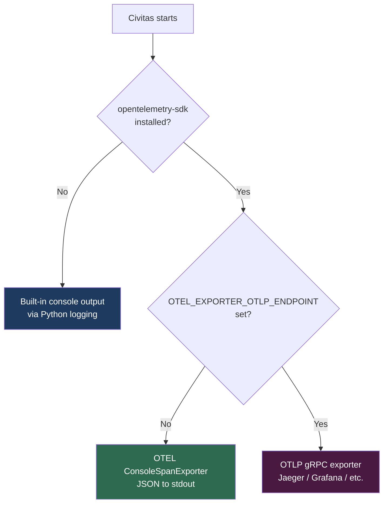
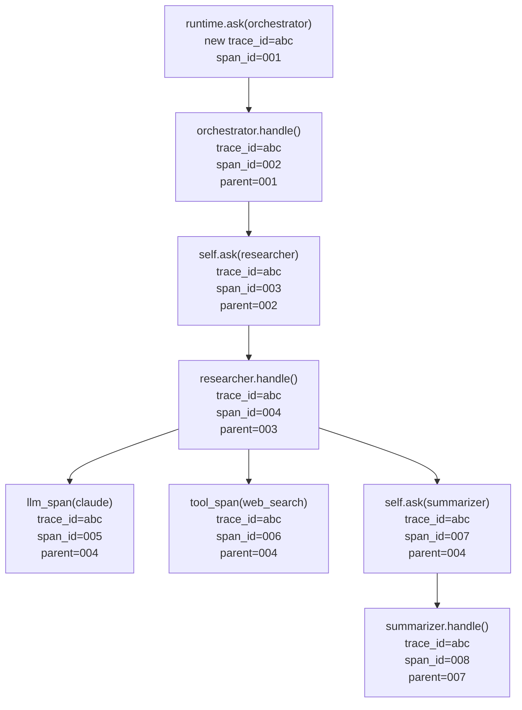

# Observability

Civitas generates OpenTelemetry spans for every message, LLM call, tool invocation, and supervisor event automatically — no instrumentation code required in your agents. This document covers what is traced, how to view it, how to export to external backends, and how to add custom spans.

---

## What is automatically traced

Every operation in the runtime emits a span:

| Operation | Span name | Key attributes |
|---|---|---|
| Message sent | `send {type}` | `civitas.sender`, `civitas.recipient`, `civitas.message_type`, `civitas.message_id` |
| Message received | `recv {type}` | `civitas.sender`, `civitas.recipient`, `civitas.message_type`, `civitas.message_id` |
| Agent started | `civitas.agent.start` | `civitas.agent.name` |
| Message handled | `civitas.agent.handle` | `civitas.agent.name`, `civitas.message_type`, `civitas.attempt` |
| Agent stopped | `civitas.agent.stop` | `civitas.agent.name` |
| Message retried | `civitas.agent.retry` | `civitas.agent.name`, `civitas.attempt` |
| Supervisor restart | `supervisor.restart` | `civitas.supervisor`, `civitas.child`, `civitas.restart_count`, `civitas.strategy`, `civitas.error` |
| LLM call | `llm.chat {model}` | `llm.model`, `llm.tokens_in`, `llm.tokens_out`, `llm.cost_usd`, `llm.latency_ms` |
| Tool invocation | `tool.execute {name}` | `tool.name`, `tool.result_status`, `tool.latency_ms` |

Zero configuration required. Run any Civitas program and these spans are emitted.

---

## Three output modes

Civitas selects the output mode automatically based on what is installed and what environment variables are set:



---

## Mode 1 — Built-in console output

**Default — no dependencies beyond `python-civitas` core.**

When `opentelemetry-sdk` is not installed, Civitas prints a human-readable summary to the console via Python's `logging` module at `DEBUG` level. Enable it:

```python
import logging
logging.basicConfig(level=logging.DEBUG)
```

Output format:

```
[10:00:00.123] orchestrator -> researcher: research_query
  [llm] claude-haiku-4-5: 1520in/430out $0.0089 2341ms
  [tool] web_search: ok 450ms
[10:00:02.480] researcher -> summarizer: summarize_request
  [llm] claude-haiku-4-5: 890in/210out $0.0003 615ms
[10:00:03.100] summarizer -> orchestrator: reply
```

This mode is zero-dependency and suitable for development. No spans are exported to any external system.

---

## Mode 2 — OTEL ConsoleSpanExporter

**Install `opentelemetry-sdk`, no endpoint configured.**

```bash
pip install civitas[otel]
```

Without `OTEL_EXPORTER_OTLP_ENDPOINT` set, Civitas configures OpenTelemetry's built-in `ConsoleSpanExporter`, which writes full OTEL-format JSON spans to stdout. Useful for verifying span structure and attributes before connecting to a real backend.

```json
{
    "name": "llm.chat claude-haiku-4-5",
    "context": {
        "trace_id": "0x4bf92f3577b34da6a3ce929d0e0e4736",
        "span_id": "0x00f067aa0ba902b7"
    },
    "parent_id": "0xa3ce929d0e0e4736",
    "start_time": "2026-04-06T10:00:00.123Z",
    "end_time": "2026-04-06T10:00:02.464Z",
    "attributes": {
        "llm.model": "claude-haiku-4-5",
        "llm.tokens_in": 1520,
        "llm.tokens_out": 430,
        "llm.cost_usd": 0.0089,
        "llm.latency_ms": 2341.2
    },
    "status": "OK"
}
```

---

## Mode 3 — OTLP export (Jaeger, Grafana, Datadog, etc.)

**Install `opentelemetry-sdk` and set `OTEL_EXPORTER_OTLP_ENDPOINT`.**

```bash
pip install civitas[otel]
export OTEL_EXPORTER_OTLP_ENDPOINT=http://localhost:4317
```

Civitas uses `BatchSpanProcessor` which exports spans in a background thread — the message loop is never blocked by network I/O. Spans are buffered and flushed automatically. On `runtime.stop()`, `force_flush()` is called to drain any pending spans.

### Jaeger (local development)

```bash
# Start Jaeger all-in-one
docker run -d \
  -p 16686:16686 \
  -p 4317:4317 \
  jaegertracing/all-in-one

export OTEL_EXPORTER_OTLP_ENDPOINT=http://localhost:4317
python examples/research_assistant.py "Compare AI safety approaches"

# Open the trace UI
open http://localhost:16686
```

In Jaeger you will see a single distributed trace per request, with all agent spans, LLM calls, tool invocations, and supervisor events linked by parent-child relationships.

### Grafana + Tempo

```bash
# Start Grafana Tempo (OTLP gRPC on port 4317)
docker run -d -p 4317:4317 -p 3200:3200 grafana/tempo

export OTEL_EXPORTER_OTLP_ENDPOINT=http://localhost:4317
python my_agent.py
```

### Other OTEL-compatible backends

Any backend accepting OTLP gRPC works: Datadog (`http://localhost:4317`), Honeycomb, New Relic, Lightstep, AWS X-Ray via ADOT collector, etc. Set `OTEL_EXPORTER_OTLP_ENDPOINT` to your collector's gRPC address.

---

## Trace context propagation

Trace context flows automatically through every message. You never set `trace_id` or `span_id` manually.



The `trace_id` is the same for every span in a causal chain. The parent-child relationships (`parent_span_id`) form the tree structure that OTEL backends render as a waterfall trace. This propagates across process and machine boundaries — spans from a Worker process appear in the same trace as spans from the supervisor process.

---

## Adding custom spans in agents

### llm_span — context manager

Use `self.llm_span()` to wrap any LLM call. It creates a span parented to the current `handle()` span and records timing automatically:

```python
class MyAgent(AgentProcess):
    async def handle(self, message: Message) -> Message | None:
        with self.llm_span("claude-haiku-4-5") as span:
            response = await self.llm.chat(
                model="claude-haiku-4-5",
                messages=[{"role": "user", "content": message.payload["question"]}],
            )
            # Enrich the span with response data
            span.set_attribute("civitas.llm.tokens_in", response.tokens_in)
            span.set_attribute("civitas.llm.tokens_out", response.tokens_out)
            span.set_attribute("civitas.llm.cost_usd", response.cost_usd)

        return self.reply({"answer": response.content})
```

Errors inside the `with` block are automatically recorded on the span before re-raising.

### tool_span — context manager

```python
class MyAgent(AgentProcess):
    async def handle(self, message: Message) -> Message | None:
        tool = self.tools.get("web_search")

        with self.tool_span("web_search") as span:
            result = await tool.execute(query=message.payload["query"])
            span.set_attribute("civitas.tool.result_count", len(result["results"]))

        return self.reply({"results": result["results"]})
```

### Custom spans via tracer directly

For anything that doesn't fit `llm_span` or `tool_span`, use `self._tracer.start_span()` directly:

```python
class MyAgent(AgentProcess):
    async def handle(self, message: Message) -> Message | None:
        span = self._tracer.start_span(
            "my_custom_operation",
            trace_id=message.trace_id,
            parent_span_id=message.span_id,
            attributes={"my.custom.attr": "value"},
        )
        try:
            result = await do_work()
            span.set_attribute("my.result.size", len(result))
        except Exception as exc:
            span.set_error(exc)
            raise
        finally:
            span.end()   # always end the span

        return self.reply({"result": result})
```

Always call `span.end()` in a `finally` block. Unclosed spans are not exported.

---

## Span attribute reference

All Civitas-emitted attributes follow the `civitas.*` and `llm.*` / `tool.*` namespace conventions:

### Message spans

| Attribute | Type | Description |
|---|---|---|
| `civitas.sender` | string | Name of the sending agent |
| `civitas.recipient` | string | Name of the target agent |
| `civitas.message_type` | string | Value of `message.type` |
| `civitas.message_id` | string | UUID7 message ID |

### Agent lifecycle spans

| Attribute | Type | Description |
|---|---|---|
| `civitas.agent.name` | string | Agent name |
| `civitas.message_type` | string | Type of message being handled |
| `civitas.attempt` | int | Retry attempt number (0 = first delivery) |

### Supervisor spans

| Attribute | Type | Description |
|---|---|---|
| `civitas.supervisor` | string | Supervisor name |
| `civitas.child` | string | Name of the restarted child |
| `civitas.restart_count` | int | Restart number for this child |
| `civitas.strategy` | string | `ONE_FOR_ONE` / `ONE_FOR_ALL` / `REST_FOR_ONE` |
| `civitas.error` | string | Exception that caused the restart |

### LLM spans

| Attribute | Type | Description |
|---|---|---|
| `llm.model` | string | Model identifier (e.g. `claude-haiku-4-5`) |
| `llm.tokens_in` | int | Input token count |
| `llm.tokens_out` | int | Output token count |
| `llm.cost_usd` | float | Estimated cost in USD |
| `llm.latency_ms` | float | End-to-end call latency in milliseconds |

### Tool spans

| Attribute | Type | Description |
|---|---|---|
| `tool.name` | string | Tool name |
| `tool.result_status` | string | `ok` or `error` |
| `tool.latency_ms` | float | Execution latency in milliseconds |

### Error attributes (any span)

| Attribute | Type | Description |
|---|---|---|
| `error` | bool | `True` if an error was recorded |
| `error.type` | string | Exception class name |
| `error.message` | string | Exception message string |

---

## SpanQueue — non-blocking export

All span emission from the message loop goes through a `SpanQueue`. The tracer calls `put_nowait()` — it never blocks. A background consumer drains the queue and calls the export backend.

If the queue fills up (default: 10,000 spans), the oldest span is dropped to make room. Losing a span is preferable to stalling the message loop. In practice this only occurs under extreme load or if the export backend is very slow.

You do not interact with the `SpanQueue` directly — it is wired by the runtime.

---

## Custom export backends

The `ExportBackend` protocol has two methods:

```python
class ExportBackend(Protocol):
    async def export(self, spans: list[SpanData]) -> None: ...
    async def shutdown(self) -> None: ...
```

Example — sending spans to a custom HTTP endpoint:

```python
from civitas.observability.export_backend import ExportBackend
from civitas.observability.span_queue import SpanData
import aiohttp

class HttpBackend:
    def __init__(self, url: str) -> None:
        self._url = url

    async def export(self, spans: list[SpanData]) -> None:
        async with aiohttp.ClientSession() as session:
            payload = [
                {
                    "name": s.name,
                    "trace_id": s.trace_id,
                    "duration_ms": (s.end_time - s.start_time) * 1000,
                    "attributes": s.attributes,
                    "status": s.status,
                }
                for s in spans
            ]
            await session.post(self._url, json=payload)

    async def shutdown(self) -> None:
        pass
```

Use `FanOutBackend` to export to multiple backends simultaneously:

```python
from civitas.observability.export_backend import FanOutBackend, ConsoleBackend

backend = FanOutBackend([
    ConsoleBackend(),
    HttpBackend("https://my-collector/spans"),
])
```

---

## Environment variables

| Variable | Default | Description |
|---|---|---|
| `OTEL_EXPORTER_OTLP_ENDPOINT` | `None` | gRPC endpoint for OTLP export. If unset, falls back to console. |
| `AGENCY_SERIALIZER` | `msgpack` | Serializer for messages: `msgpack` or `json`. |

Standard OTEL SDK environment variables (`OTEL_SERVICE_NAME`, `OTEL_RESOURCE_ATTRIBUTES`, etc.) are respected when `opentelemetry-sdk` is installed.

---

## Cost attribution

Every LLM span carries `llm.cost_usd`. Aggregating this attribute by `civitas.agent.name` in your OTEL backend gives you per-agent cost attribution over time:

```
orchestrator   $0.0421  (3 LLM calls)
researcher     $0.0089  (1 LLM call)
summarizer     $0.0003  (1 LLM call)
─────────────────────────────────────
Total          $0.0513
```

The Anthropic provider computes cost from the model's token pricing. The LiteLLM provider uses LiteLLM's built-in cost calculation. Custom providers should populate `cost_usd` in `ModelResponse` for this to work.

---

## Tips

**Jaeger trace not appearing?** Check that `OTEL_EXPORTER_OTLP_ENDPOINT` points to the gRPC port (default `4317`), not the HTTP port (`4318`) or the Jaeger UI port (`16686`).

**Spans not flushed on exit?** Ensure `await runtime.stop()` is called — it calls `force_flush()` on the OTEL provider. If you `Ctrl+C`, register a signal handler that calls `runtime.stop()`.

**Too much noise in console mode?** The built-in console output is at `DEBUG` level. Set `logging.basicConfig(level=logging.INFO)` to suppress it while keeping application logs.

**Adding trace context to external HTTP calls?** Inject `message.trace_id` and `message.span_id` as HTTP headers in your tool implementation to continue the trace across service boundaries.
