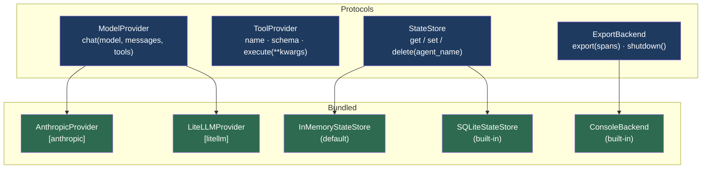

# Plugins

Civitas's plugin system covers everything outside the core runtime: LLM providers, tools, state stores, and observability exporters. Every plugin is a Python protocol — no base class to inherit, no registration ceremony. Any class with the right method signatures works.

---

## Plugin overview



Plugins are injected by `Runtime` at startup. Agents access them via `self.llm`, `self.tools`, and `self.store`. You configure them once in `Runtime(...)` or topology YAML — agent code never constructs or imports plugins directly.

---

## Install

```bash
pip install civitas                   # core only
pip install civitas[anthropic]        # + Anthropic LLM provider
pip install civitas[litellm]          # + 100+ models via LiteLLM
pip install civitas[otel]             # + OpenTelemetry tracing
pip install civitas[zmq]              # + ZMQ multi-process transport
pip install civitas[nats]             # + NATS distributed transport
pip install civitas[anthropic,otel]   # typical dev setup
```

---

## ModelProvider

### Protocol

```python
class ModelProvider(Protocol):
    async def chat(
        self,
        model: str,
        messages: list[dict[str, Any]],
        tools: list[Any] | None = None,
    ) -> ModelResponse: ...
```

`ModelResponse` carries the result:

```python
@dataclass
class ModelResponse:
    content: str              # text content of the response
    model: str                # model ID actually used
    tokens_in: int            # input token count
    tokens_out: int           # output token count
    cost_usd: float | None    # estimated cost, or None if pricing unknown
    tool_calls: list[ToolCall] | None  # tool call requests from the model
```

### AnthropicProvider

```bash
pip install civitas[anthropic]
export ANTHROPIC_API_KEY=sk-...
```

```python
from civitas.plugins.anthropic import AnthropicProvider

runtime = Runtime(
    supervisor=Supervisor("root", children=[...]),
    model_provider=AnthropicProvider(
        api_key=None,                    # reads ANTHROPIC_API_KEY from env if not set
        default_model="claude-sonnet-4-6",
        max_tokens=4096,
        max_retries=3,                   # SDK-level retry with exponential backoff
    ),
)
```

Inside an agent:

```python
async def handle(self, message: Message) -> Message | None:
    response = await self.llm.chat(
        model="claude-haiku-4-5-20251001",
        messages=[{"role": "user", "content": message.payload["question"]}],
    )
    # response.content     — text answer
    # response.tokens_in   — input tokens used
    # response.tokens_out  — output tokens used
    # response.cost_usd    — cost in USD (computed from known pricing)
    return self.reply({"answer": response.content})
```

Pass `model=None` to use the provider's `default_model`.

**Supported models and pricing (built-in):**

| Model | Input $/M tokens | Output $/M tokens |
|---|---|---|
| `claude-sonnet-4-6` | $3.00 | $15.00 |
| `claude-haiku-4-5-20251001` | $0.80 | $4.00 |
| `claude-opus-4-5-20251001` | $15.00 | $75.00 |
| `claude-3-5-sonnet-20241022` | $3.00 | $15.00 |

For models not in the pricing table, `cost_usd` is `None`.

### LiteLLMProvider

Covers OpenAI, Google Gemini, AWS Bedrock, Azure, Cohere, Mistral, and 100+ other providers via [LiteLLM](https://docs.litellm.ai).

```bash
pip install civitas[litellm]
```

```python
from civitas.plugins.litellm import LiteLLMProvider

# OpenAI
runtime = Runtime(
    model_provider=LiteLLMProvider(default_model="gpt-4o"),
    ...
)

# Google Gemini
runtime = Runtime(
    model_provider=LiteLLMProvider(default_model="gemini/gemini-2.0-flash"),
    ...
)

# AWS Bedrock
runtime = Runtime(
    model_provider=LiteLLMProvider(default_model="bedrock/claude-3-5-sonnet-20241022"),
    ...
)
```

Agent code is identical regardless of which provider is configured — only the `Runtime` constructor changes.

### Writing a custom ModelProvider

Any class with a `chat()` method satisfying the signature works:

```python
from civitas.plugins.model import ModelResponse

class MyProvider:
    """Custom provider wrapping a local model."""

    async def chat(
        self,
        model: str,
        messages: list[dict],
        tools: list | None = None,
    ) -> ModelResponse:
        # call your local model, API, or mock
        result = call_my_model(model, messages)
        return ModelResponse(
            content=result["text"],
            model=model,
            tokens_in=result["tokens_in"],
            tokens_out=result["tokens_out"],
            cost_usd=None,   # unknown pricing
        )

runtime = Runtime(
    supervisor=...,
    model_provider=MyProvider(),
)
```

No registration needed. Pass the instance directly to `Runtime`.

---

## ToolProvider and ToolRegistry

### Protocol

```python
class ToolProvider(Protocol):
    @property
    def name(self) -> str: ...           # unique tool name
    @property
    def schema(self) -> dict: ...        # JSON Schema for inputs
    async def execute(self, **kwargs) -> Any: ...
```

### Registering tools

```python
from civitas.plugins.tools import ToolRegistry

tools = ToolRegistry()
tools.register(WebSearchTool())
tools.register(CalculatorTool())

runtime = Runtime(
    supervisor=Supervisor("root", children=[...]),
    tool_registry=tools,
)
```

Duplicate names raise `ValueError` immediately — silent overwrite would cause the wrong implementation to be called.

### Using tools inside agents

```python
class ResearchAgent(AgentProcess):
    async def handle(self, message: Message) -> Message | None:
        # Look up by name
        search = self.tools.get("web_search")
        if search is None:
            return self.reply({"error": "tool not available"})

        with self.tool_span("web_search"):
            result = await search.execute(query=message.payload["query"])

        return self.reply({"results": result})
```

### Writing a tool

```python
from typing import Any

class WebSearchTool:
    name = "web_search"

    schema: dict[str, Any] = {
        "name": "web_search",
        "description": "Search the web for information",
        "input_schema": {
            "type": "object",
            "properties": {
                "query": {
                    "type": "string",
                    "description": "The search query",
                },
                "max_results": {
                    "type": "integer",
                    "description": "Maximum number of results to return",
                    "default": 5,
                },
            },
            "required": ["query"],
        },
    }

    async def execute(self, **kwargs: Any) -> Any:
        query = kwargs["query"]
        max_results = kwargs.get("max_results", 5)
        # ... perform search ...
        return {"results": [...]}
```

The `schema` field follows the Anthropic tool schema format (`input_schema` key). LiteLLM normalizes this across providers automatically when passed through `self.llm.chat(..., tools=[tool.schema])`.

### Passing tools to the LLM

To let the LLM decide which tool to call (tool use / function calling):

```python
async def handle(self, message: Message) -> Message | None:
    # Collect schemas for all registered tools
    tool_schemas = [t.schema for t in self.tools.list_tools()]

    response = await self.llm.chat(
        model="claude-sonnet-4-6",
        messages=[{"role": "user", "content": message.payload["question"]}],
        tools=tool_schemas,
    )

    # Handle tool calls requested by the model
    if response.tool_calls:
        for tc in response.tool_calls:
            tool = self.tools.get(tc.name)
            if tool:
                result = await tool.execute(**tc.input)
                # continue conversation with tool result ...

    return self.reply({"answer": response.content})
```

---

## StateStore

State stores persist agent checkpoints across restarts. An agent calls `await self.checkpoint()` to save `self.state`; on restart, the runtime restores it automatically before `on_start()`.

### Protocol

```python
class StateStore(Protocol):
    async def get(self, agent_name: str) -> dict | None: ...
    async def set(self, agent_name: str, state: dict) -> None: ...
    async def delete(self, agent_name: str) -> None: ...
```

### InMemoryStateStore (default)

```python
from civitas.plugins.state import InMemoryStateStore

runtime = Runtime(
    supervisor=...,
    state_store=InMemoryStateStore(),   # this is the default
)
```

State survives supervisor restarts within the same process lifetime. State is lost when the process exits. Suitable for development and for agents that don't require durable state.

### SQLiteStateStore

```python
from civitas.plugins.sqlite_store import SQLiteStateStore

runtime = Runtime(
    supervisor=...,
    state_store=SQLiteStateStore("agency_state.db"),
)
```

State is persisted to a local SQLite database as JSON. Survives process exits and machine restarts. All I/O runs in a thread executor — SQLite operations never block the asyncio event loop.

```python
# The agent — unchanged regardless of which store is configured
class WorkflowAgent(AgentProcess):
    async def on_start(self) -> None:
        # self.state is already restored from the last checkpoint
        print(f"Resuming from step {self.state.get('step', 0)}")

    async def handle(self, message: Message) -> Message | None:
        self.state["step"] = self.state.get("step", 0) + 1
        self.state["last_input"] = message.payload

        await self.checkpoint()   # persist to SQLiteStateStore
        return self.reply({"step": self.state["step"]})
```

**CLI state management:**

```bash
civitas state list                  # show all agents with persisted state
civitas state show <agent-name>     # inspect a specific agent's state
civitas state clear <agent-name>    # reset an agent to a clean start
```

### Writing a custom StateStore

```python
import aioredis

class RedisStateStore:
    """State store backed by Redis."""

    def __init__(self, url: str = "redis://localhost") -> None:
        self._redis = None
        self._url = url

    async def _ensure_connected(self):
        if self._redis is None:
            self._redis = await aioredis.from_url(self._url)

    async def get(self, agent_name: str) -> dict | None:
        await self._ensure_connected()
        data = await self._redis.get(f"civitas:state:{agent_name}")
        return json.loads(data) if data else None

    async def set(self, agent_name: str, state: dict) -> None:
        await self._ensure_connected()
        await self._redis.set(f"civitas:state:{agent_name}", json.dumps(state))

    async def delete(self, agent_name: str) -> None:
        await self._ensure_connected()
        await self._redis.delete(f"civitas:state:{agent_name}")

runtime = Runtime(
    supervisor=...,
    state_store=RedisStateStore("redis://my-redis:6379"),
)
```

---

## Loading plugins from YAML

All plugins can be configured from the topology YAML without importing them in code:

```yaml
plugins:
  models:
    - type: anthropic
      config:
        default_model: claude-sonnet-4-6
        max_tokens: 8192

  exporters:
    - type: console

  state:
    type: sqlite
    config:
      db_path: agency_state.db
```

Plugin resolution order:
1. **Python entrypoints** — installed packages that register under `civitas.model`, `civitas.exporter`, `civitas.state`, or `civitas.transport`
2. **Built-in names** — `anthropic`, `litellm`, `console`, `in_memory`, `sqlite`, `in_process`, `zmq`, `nats`
3. **Dotted import path** — e.g. `myapp.plugins.MyProvider`

### Registering a plugin via entrypoint

To make a third-party plugin loadable by name from YAML, register it in your package's `pyproject.toml`:

```toml
[project.entry-points."civitas.model"]
my_provider = "mypkg.providers:MyProvider"

[project.entry-points."civitas.state"]
redis = "mypkg.stores:RedisStateStore"
```

After `pip install mypkg`, the plugin is available in YAML:

```yaml
plugins:
  models:
    - type: my_provider
      config:
        api_url: https://my-api.example.com
  state:
    type: redis
    config:
      url: redis://localhost
```

---

## Plugin error handling

If a plugin fails to load — missing dependency, wrong constructor args, bad import path — `PluginError` is raised at startup with a clear message:

```
civitas.errors.PluginError: Failed to load model plugin 'anthropic':
  No module named 'anthropic'
  Hint: pip install civitas[anthropic]
```

This fails fast at `Runtime.start()`, before any agents are started, so there's no ambiguity about what went wrong.
