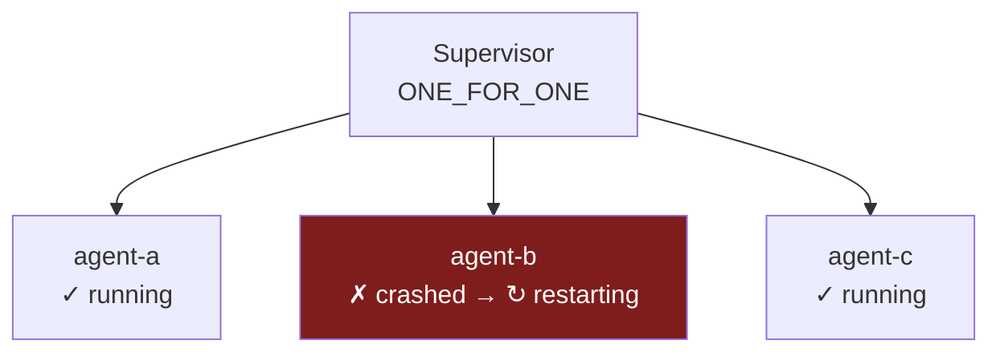
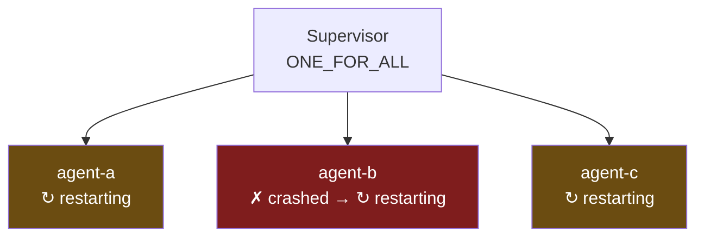
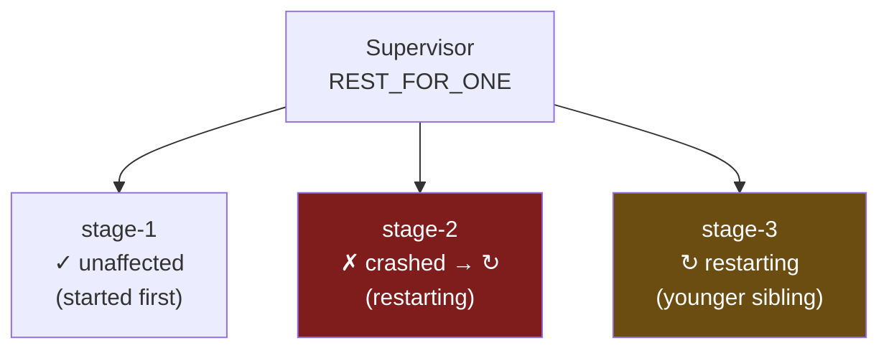
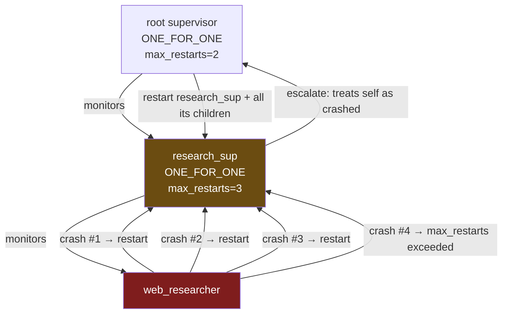
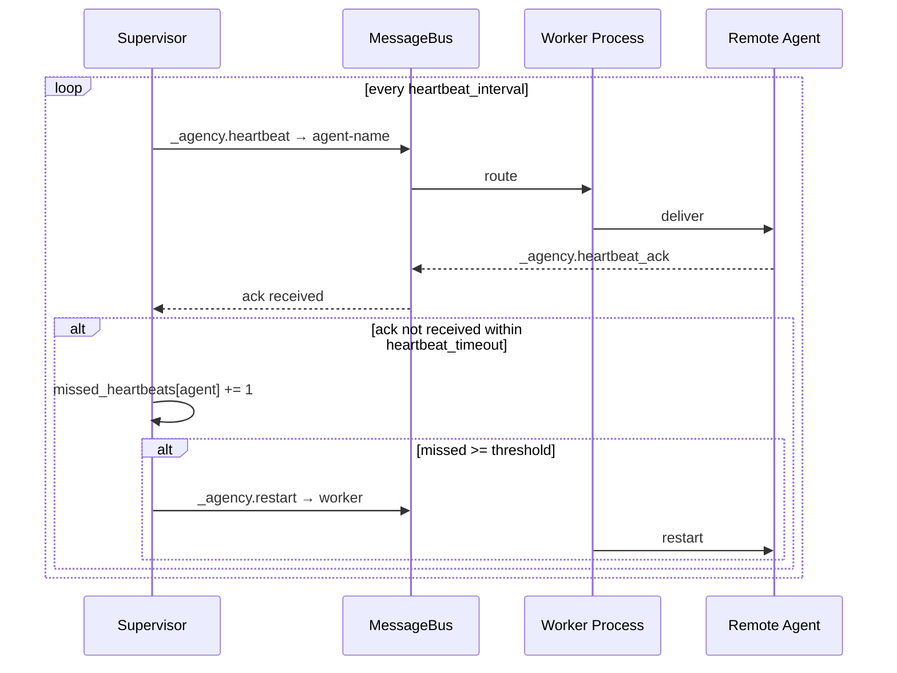

# Supervision

Supervision is Civitas's core fault-tolerance mechanism. This document covers everything about configuring and composing supervisors: restart strategies, backoff policies, escalation chains, nested trees, and heartbeat-based monitoring for remote agents.

---

## The "let it crash" principle

Civitas's supervision model is borrowed from Erlang/OTP, and its central idea is counterintuitive: **don't try to recover from errors inside the failing code**. Let the process crash cleanly. A supervisor — which is separate from the failing code — decides what to do.

This separation matters because:

- Error handling inside `handle()` is speculative. You can't always predict what state the agent is in after an error.
- A supervisor has a broader view: it knows the system's current restart rate, its history, and the relationships between processes.
- Defensive error-handling code in `handle()` tends to hide bugs. Crashing loudly surfaces them.

The practical implication: keep `on_error()` simple. Return `ErrorAction.ESCALATE` unless you have a specific, well-understood retry policy. Let the supervisor do its job.

---

## Supervisor constructor

```python
Supervisor(
    name="root",
    children=[...],                # AgentProcess or Supervisor instances
    strategy="ONE_FOR_ONE",        # or ONE_FOR_ALL, REST_FOR_ONE
    max_restarts=3,                # crash limit within restart_window
    restart_window=60.0,           # sliding window in seconds
    backoff="CONSTANT",            # or LINEAR, EXPONENTIAL
    backoff_base=1.0,              # initial delay in seconds
    backoff_max=60.0,              # maximum delay cap in seconds
)
```

All parameters have defaults. A minimal supervisor:

```python
Supervisor("root", children=[MyAgent("agent")])
```

---

## Restart strategies

### ONE_FOR_ONE

When a child crashes, restart **only that child**. All other children continue running unaffected.



**Use when:** Children are independent — a crash in one does not invalidate the state of others.

**Examples:**
- A pool of worker agents each handling independent requests
- Multiple API integrations running in parallel
- Stateless agents that process one message at a time

```python
Supervisor(
    "workers",
    strategy="ONE_FOR_ONE",
    children=[
        Worker("worker-1"),
        Worker("worker-2"),
        Worker("worker-3"),
    ],
)
```

---

### ONE_FOR_ALL

When any child crashes, **stop and restart all children**.



**Use when:** Children share mutable state or maintain synchronized positions. If one crashes, the others' state is no longer valid and they must start fresh.

**Examples:**
- A producer and consumer that share a queue reference
- A writer and a cache agent that must stay synchronized
- A leader and followers in a coordinated protocol

```python
Supervisor(
    "pipeline",
    strategy="ONE_FOR_ALL",
    children=[
        Producer("producer"),
        Consumer("consumer"),
    ],
)
```

---

### REST_FOR_ONE

When a child crashes, restart that child **and all children that were started after it** (younger siblings). Children started earlier are unaffected.



**Use when:** You have a pipeline where later stages depend on earlier ones. If stage-2 crashes, stage-3 is receiving invalid input and must also restart.

**Examples:**
- Sequential processing stages: fetcher → parser → indexer
- A connection stage followed by one or more dependent processing stages

```python
Supervisor(
    "pipeline",
    strategy="REST_FOR_ONE",
    children=[
        Fetcher("fetcher"),      # if fetcher crashes, parser and indexer also restart
        Parser("parser"),        # if parser crashes, indexer also restarts
        Indexer("indexer"),      # if indexer crashes, only indexer restarts
    ],
)
```

---

## Backoff policies

Between each restart attempt, the supervisor waits a calculated delay. This prevents retry storms when a downstream dependency is unavailable.

| Policy | Formula | Example (base=1.0s, attempts 1–5) |
|---|---|---|
| `CONSTANT` | `base` | 1s, 1s, 1s, 1s, 1s |
| `LINEAR` | `base × attempt` | 1s, 2s, 3s, 4s, 5s |
| `EXPONENTIAL` | `base × 2^(attempt−1)` ± jitter | ~1s, ~2s, ~4s, ~8s, ~16s |

`EXPONENTIAL` adds up to 25% random jitter per attempt to prevent multiple agents from retrying in lockstep.

All delays are capped at `backoff_max` (default 60s).

```python
Supervisor(
    "root",
    backoff="EXPONENTIAL",
    backoff_base=0.5,    # start at 0.5s
    backoff_max=30.0,    # cap at 30s
    children=[...],
)
```

**Choosing a policy:**

- **Development / tests:** `CONSTANT` with a short base (e.g. `backoff_base=0.1`) so restarts are fast and visible.
- **Production with transient failures:** `EXPONENTIAL` — gives downstream services time to recover.
- **Production with predictable failures:** `LINEAR` — gradual back-off without the compounding of exponential.

---

## Sliding window rate limiting

The supervisor counts crashes within a sliding time window. If `max_restarts` crashes occur within `restart_window` seconds, the supervisor escalates instead of restarting.

```
max_restarts=3, restart_window=60.0

t=0s   → crash 1  →  1 crash in window  →  restart
t=10s  → crash 2  →  2 crashes in window →  restart
t=20s  → crash 3  →  3 crashes in window →  restart
t=30s  → crash 4  →  4 crashes in window →  ESCALATE
```

But:
```
t=0s   → crash 1  →  1 crash in window  →  restart
t=10s  → crash 2  →  2 crashes in window →  restart
t=70s  → crash 3  →  2 crashes in window (t=0 has expired) →  restart
t=80s  → crash 4  →  3 crashes in window →  restart
```

The window slides continuously — it's not a fixed interval that resets.

**Tuning guidance:**

| Scenario | `max_restarts` | `restart_window` |
|---|---|---|
| Transient network errors expected | 5–10 | 60s |
| Bugs should surface quickly | 2–3 | 30s |
| Long-running critical process | 3 | 300s |
| Development / testing | 10+ | 60s |

---

## Escalation chain

When a supervisor exhausts its restart budget, it escalates to its own parent supervisor. The parent treats the child supervisor as if it were a crashed agent and applies its own restart strategy.



If the root supervisor also exhausts its budget, the process stops permanently and an error is logged. There is no escalation above the root.

---

## Nested supervisors

Supervisors can contain other supervisors. This is the primary tool for building complex fault-tolerance topologies where different subsystems have different failure policies.

```python
Runtime(
    supervisor=Supervisor(
        "root",
        strategy="ONE_FOR_ONE",
        max_restarts=2,
        children=[
            # Research subsystem — failures isolated here
            Supervisor(
                "research_sup",
                strategy="ONE_FOR_ONE",
                max_restarts=5,
                backoff="EXPONENTIAL",
                children=[
                    WebResearcher("web_researcher"),
                    DocSearcher("doc_searcher"),
                ],
            ),
            # Execution subsystem — all-or-nothing restart
            Supervisor(
                "execution_sup",
                strategy="ONE_FOR_ALL",
                max_restarts=3,
                children=[
                    ApiCaller("api_caller"),
                    DbWriter("db_writer"),
                ],
            ),
            # Standalone agent at root level
            Orchestrator("orchestrator"),
        ],
    )
)
```

With this tree:

- `web_researcher` crashes → `research_sup` restarts it → `execution_sup` and `orchestrator` unaffected
- `api_caller` crashes → `execution_sup` restarts both `api_caller` and `db_writer` → `research_sup` and `orchestrator` unaffected
- `research_sup` exhausts its budget → escalates to `root` → `root` restarts `research_sup` (and its children)

From YAML:

```yaml
supervision:
  name: root
  strategy: ONE_FOR_ONE
  max_restarts: 2
  children:
    - supervisor:
        name: research_sup
        strategy: ONE_FOR_ONE
        max_restarts: 5
        backoff: EXPONENTIAL
        children:
          - agent: { name: web_researcher, type: myapp.WebResearcher }
          - agent: { name: doc_searcher,   type: myapp.DocSearcher }
    - supervisor:
        name: execution_sup
        strategy: ONE_FOR_ALL
        max_restarts: 3
        children:
          - agent: { name: api_caller, type: myapp.ApiCaller }
          - agent: { name: db_writer,  type: myapp.DbWriter }
    - agent: { name: orchestrator, type: myapp.Orchestrator }
```

---

## Heartbeat monitoring for remote agents

When agents run in separate OS processes (ZMQ or NATS transport), the supervisor cannot monitor them via asyncio task callbacks — the tasks are in a different process. Instead, it uses periodic heartbeats.



Heartbeat monitoring is configured per remote child via `add_remote_child()`, or automatically when loading a topology YAML with `process: worker` entries:

```python
supervisor.add_remote_child(
    name="remote_agent",
    heartbeat_interval=5.0,        # ping every 5 seconds
    heartbeat_timeout=2.0,         # wait up to 2 seconds for ack
    missed_heartbeats_threshold=3, # restart after 3 consecutive misses
)
```

In YAML topology:

```yaml
- agent:
    name: remote_agent
    type: myapp.RemoteAgent
    process: worker            # runs in a Worker process
    heartbeat_interval: 5.0
    heartbeat_timeout: 2.0
    missed_heartbeats_threshold: 3
```

The backoff and restart strategy configured on the parent supervisor apply to remote restarts too — only the detection mechanism differs.

---

## Supervision and error actions

The supervision strategy only applies when an agent returns `ErrorAction.ESCALATE` from `on_error()`, or when `on_error()` itself raises an exception. Other error actions are handled inside the agent:

| `ErrorAction` | Who handles it | Supervisor involved? |
|---|---|---|
| `RETRY` | Runtime re-delivers the message | No |
| `SKIP` | Runtime discards the message | No |
| `STOP` | Runtime shuts down the agent gracefully | No |
| `ESCALATE` | Agent crashes → **supervisor takes over** | **Yes** |

The default `on_error()` returns `ESCALATE`. Override it when you have a meaningful retry policy:

```python
async def on_error(self, error: Exception, message: Message) -> ErrorAction:
    if isinstance(error, RateLimitError) and message.attempt < 3:
        return ErrorAction.RETRY     # re-deliver, supervisor not involved
    if isinstance(error, ValidationError):
        return ErrorAction.SKIP      # bad message, move on
    return ErrorAction.ESCALATE      # anything else: crash and let supervisor decide
```

---

## Observability

Every supervisor restart emits an OTEL span with the following attributes:

| Attribute | Value |
|---|---|
| `civitas.supervisor` | Supervisor name |
| `civitas.child` | Name of the restarted child |
| `civitas.restart_count` | Restart number for this child |
| `civitas.strategy` | `ONE_FOR_ONE` / `ONE_FOR_ALL` / `REST_FOR_ONE` |
| `civitas.error` | Exception string that caused the restart |

These spans are linked to the agent's trace, so you can see the full causal chain: which message triggered the crash, how many restarts occurred, and when the agent recovered.

---

## Common patterns

**Pattern: Fast restarts in development, conservative in production**

```python
import os

Supervisor(
    "root",
    max_restarts=10 if os.getenv("ENV") == "dev" else 3,
    restart_window=60.0,
    backoff="CONSTANT" if os.getenv("ENV") == "dev" else "EXPONENTIAL",
    backoff_base=0.05 if os.getenv("ENV") == "dev" else 1.0,
    children=[...],
)
```

**Pattern: Isolate an unreliable integration**

Put unreliable agents under their own supervisor with a generous restart budget, separate from the rest of the system:

```python
Supervisor("root", strategy="ONE_FOR_ONE", children=[
    Supervisor(
        "flaky_api_sup",
        strategy="ONE_FOR_ONE",
        max_restarts=10,
        backoff="EXPONENTIAL",
        children=[FlakyApiAgent("flaky_api")],
    ),
    StableAgent("stable"),
])
```

`stable` is completely unaffected by however many times `flaky_api` crashes.

**Pattern: Circuit breaker via max_restarts**

Set `max_restarts` low on purpose to stop hammering a downstream service that is down. Let it escalate to the root, which restarts the entire subsystem after a longer backoff:

```python
Supervisor("root", strategy="ONE_FOR_ONE", backoff="EXPONENTIAL", backoff_base=30.0, children=[
    Supervisor(
        "db_sup",
        strategy="ONE_FOR_ONE",
        max_restarts=2,        # fail fast
        restart_window=30.0,
        backoff="CONSTANT",
        backoff_base=1.0,
        children=[DbAgent("db")],
    ),
])
```

After 2 failures in 30 seconds, `db_sup` escalates to `root`, which waits ~30s (exponential base) before restarting the subsystem.

---

## Dynamic supervision

Static supervision — the `Supervisor` class — covers processes whose identity is known at deploy time. Dynamic supervision covers processes that are created and destroyed at runtime, such as per-request workers, user sessions, or spawned research agents.

### DynamicSupervisor

`DynamicSupervisor` is a separate class from `Supervisor`. It follows Erlang's design: the two are deliberately distinct because `ONE_FOR_ALL` and `REST_FOR_ONE` strategies depend on a fixed, ordered child list and lose coherence when children arrive and leave dynamically. `DynamicSupervisor` is always `ONE_FOR_ONE`.

```python
from civitas import DynamicSupervisor, Supervisor, Runtime

dyn = DynamicSupervisor(
    name="workers",
    max_children=20,           # hard capacity limit; spawn raises SpawnError when reached
    max_total_spawns=1000,     # optional lifetime cap across all spawns
)

runtime = Runtime(supervisor=Supervisor("root", children=[orchestrator, dyn]))
```

Or in YAML:

```yaml
supervision:
  name: root
  strategy: ONE_FOR_ONE
  children:
    - type: dynamic_supervisor
      name: workers
      config:
        max_children: 20
        max_total_spawns: 1000
    - type: agent
      name: orchestrator
      module: myapp.agents
      class: OrchestratorAgent
```

`DynamicSupervisor` starts empty. Children are added at runtime via `self.spawn()`.

### Spawning agents

Any agent that has a `DynamicSupervisor` as a sibling or ancestor can spawn children using `self.spawn()`. The runtime resolves the **nearest ancestor `DynamicSupervisor`** automatically — you don't name the target.

```python
class OrchestratorAgent(AgentProcess):
    async def on_start(self) -> None:
        # Finds the nearest DynamicSupervisor ("workers") automatically
        name = await self.spawn(ResearchAgent, name="researcher-1")
```

`spawn()` sends a `civitas.dynamic.spawn` message to the `DynamicSupervisor` by name and awaits confirmation. It returns the agent name on success and raises `SpawnError` on failure (capacity reached, duplicate name, governance veto).

#### Despawn and stop

```python
# Hard stop — cancels the task immediately; on_stop() still fires
await self.despawn("researcher-1")

# Soft stop — drain current message, then stop
await self.stop("researcher-1", drain="current", timeout=10.0)

# Soft stop — drain entire queue, then stop
await self.stop("researcher-1", drain="all", timeout=30.0)
```

`stop()` is awaitable and returns when the agent is fully stopped. If the agent does not stop within `timeout` seconds, it is force-cancelled.

### Restart modes

Dynamic children have a `restart_mode` that controls what happens when they exit:

| Mode | Behaviour |
|---|---|
| `TRANSIENT` (default) | Restarted only on abnormal exit (exception). Clean exit is not restarted. |
| `PERMANENT` | Always restarted, regardless of how it exited. |
| `NEVER` | Never restarted. When it exits for any reason, the slot is freed and the spawning agent is notified. |

Pass `restart_mode` when spawning:

```python
from civitas.supervisor import RestartMode

await self.spawn(WorkerAgent, name="worker-1", restart_mode=RestartMode.NEVER)
```

Unlike `Supervisor`, `DynamicSupervisor` does **not** escalate to its parent when a child exhausts its restart budget. Instead, it calls `on_child_terminated()` on the spawning agent.

### Governance

Override `on_spawn_requested()` on a `DynamicSupervisor` subclass to implement policy checks before a spawn is committed:

```python
class GovernedPool(DynamicSupervisor):
    async def on_spawn_requested(self, agent_class, name: str, config: dict) -> bool:
        if name in self._blocklist:
            return False           # deny
        return True                # approve
```

Returning `False` causes `self.spawn()` at the call site to raise `SpawnError("spawn denied by governance hook")`.

### Termination notifications

When a dynamic child exits (for any reason, including `despawn` or restart exhaustion), the spawning agent's `on_child_terminated()` hook is called:

```python
class OrchestratorAgent(AgentProcess):
    async def on_child_terminated(self, name: str, reason: str) -> None:
        # name  — the agent that exited
        # reason — "clean_exit" | "exception" | "despawned" | "exhausted"
        logger.warning("child %s terminated: %s", name, reason)
```

The default implementation just logs a warning.

### External API

`Runtime` exposes `spawn`, `despawn`, and `stop_agent` for external control — useful for tests or admin scripts:

```python
await runtime.spawn("workers", ResearchAgent, name="researcher-1")
await runtime.despawn("workers", "researcher-1")
await runtime.stop_agent("workers", "researcher-1", drain="current", timeout=5.0)
```

### TopologyServer

`TopologyServer` is a supervised HTTP endpoint that exposes live topology state. Declare it in YAML as a sibling of other children:

```yaml
- type: topology_server
  name: topo_server
  config:
    host: 127.0.0.1   # default
    port: 6789        # default
```

Endpoints (all read-only, JSON):

| Endpoint | Response |
|---|---|
| `GET /health` | `{"status": "ok"}` |
| `GET /topology` | Full supervision tree with live dynamic children and their statuses |
| `GET /agents` | Flat list of all agents including dynamically spawned ones |
| `GET /agents/{name}` | Single agent status or `{"error": "..."}` with 404 |

`civitas topology show` automatically pings `/topology` if a `topology_server` node is present in the YAML. If the server is unreachable (runtime not running), it falls back to rendering the static YAML tree with a `(runtime not running)` annotation.

See [examples/dynamic_spawning.py](../examples/dynamic_spawning.py) for a complete working example.
