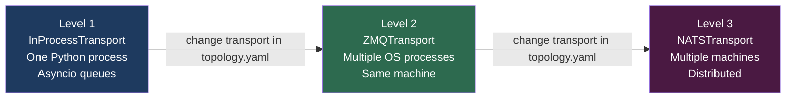
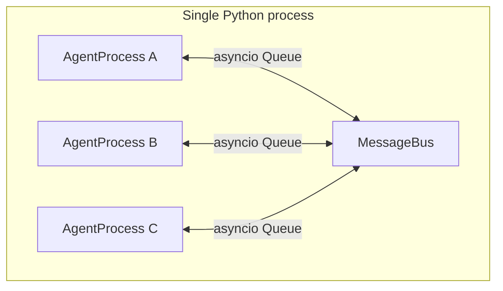
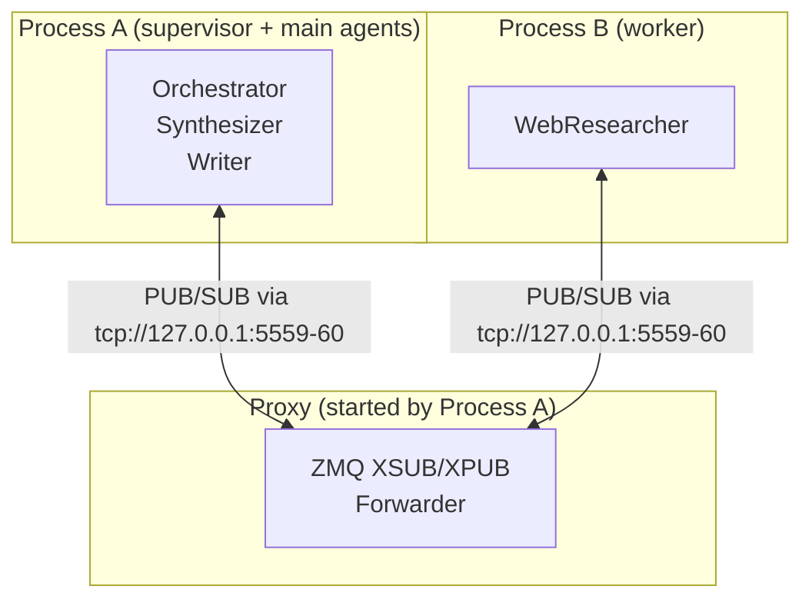
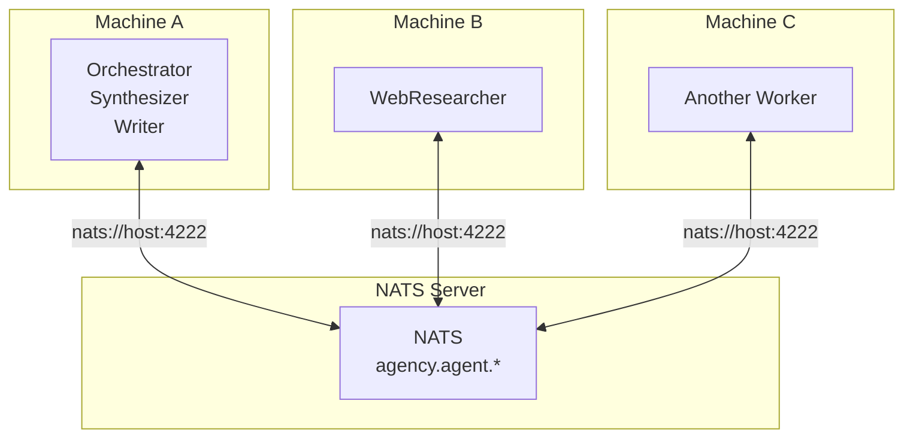

# Transports

The transport is the delivery layer underneath the MessageBus. Agency provides three implementations that form a deployment scaling ladder — from a single Python process to a distributed multi-machine cluster. The same agent code runs at every level; only the topology configuration changes.

---

## The scaling ladder



The agent code is byte-for-byte identical at every level. The `MessageBus` and `Registry` interfaces stay the same. Only the `transport:` block in your topology YAML changes.

---

## Transport protocol

All three transports implement the same five-method protocol:

```python
class Transport(Protocol):
    async def start(self) -> None:
        """Initialize connections, bind sockets."""

    async def stop(self) -> None:
        """Gracefully close connections, flush pending messages."""

    async def subscribe(self, address: str, handler: Callable[[bytes], Awaitable[None]]) -> None:
        """Register a handler for messages arriving at this address."""

    async def publish(self, address: str, data: bytes) -> None:
        """Send a message to an address (fire-and-forget)."""

    async def request(self, address: str, data: bytes, timeout: float) -> bytes:
        """Send a message and await a reply."""

    async def wait_ready(self) -> None:
        """Wait for connections and subscriptions to stabilize."""

    def has_reply_address(self, address: str) -> bool:
        """Return True if address is an active ephemeral reply queue."""
```

Any class implementing these methods can be used as a transport. See [writing a custom transport](#writing-a-custom-transport) below.

---

## Level 1 — InProcessTransport

**Default for development and single-process deployments.**



Messages are delivered by placing serialized bytes into the recipient's asyncio queue. Despite being in-process, messages are still serialized through msgpack — this ensures that swapping to ZMQ or NATS never requires changing agent code.

**Install:** No extra dependencies — included in the core package.

**Configuration:**

```python
# Programmatic — default, no configuration needed
runtime = Runtime(
    supervisor=Supervisor("root", children=[...]),
    # transport="in_process" is the default
)
```

```yaml
# topology.yaml
transport:
  type: in_process
```

**Characteristics:**

| Property | Value |
|---|---|
| Extra dependencies | None |
| Message latency | ~2–5 µs (serialization overhead) |
| Process boundary | None — same Python process |
| Backpressure | Bounded asyncio queues |
| Request-reply | Ephemeral asyncio queues (in-memory) |
| Fault tolerance | Supervisor task callbacks |

**When to use:**

- Development and testing
- Single-machine deployments where process isolation is not needed
- All examples in the repo that don't specify a transport

---

## Level 2 — ZMQTransport

**Multi-process on a single machine.**



ZMQ uses an XSUB/XPUB proxy to bridge PUB/SUB across OS processes. One process starts the proxy; all other processes connect to it. Request-reply uses ephemeral PUB/SUB topics — the same pattern as InProcess, but over TCP sockets.

**Install:**

```bash
pip install python-agency[zmq]
```

**Configuration:**

```python
# Programmatic
runtime = Runtime(
    supervisor=Supervisor("root", children=[...]),
    transport="zmq",
    zmq_pub_addr="tcp://127.0.0.1:5559",
    zmq_sub_addr="tcp://127.0.0.1:5560",
    zmq_start_proxy=True,   # start the proxy in this process
)
```

```yaml
# topology.yaml
transport:
  type: zmq
  pub_addr: "tcp://127.0.0.1:5559"
  sub_addr: "tcp://127.0.0.1:5560"
  start_proxy: true
```

**Characteristics:**

| Property | Value |
|---|---|
| Extra dependencies | `pyzmq` |
| Message latency | ~50–200 µs (local TCP) |
| Process boundary | OS process (on same machine) |
| Backpressure | ZMQ high-water mark + asyncio queues |
| Request-reply | Ephemeral PUB/SUB topics via proxy |
| Fault tolerance | Heartbeat-based (supervisor pings worker agents) |

**When to use:**

- Scale beyond the GIL by distributing agents across OS processes
- Isolate agent processes so a crash in one doesn't affect others' memory
- GPU agents that need their own process (TensorFlow/PyTorch process isolation)
- Single-machine staging before moving to distributed

### Running multi-process with the CLI

```bash
# Terminal 1 — supervisor process (starts the ZMQ proxy)
agency run --topology examples/multi_process.yaml --process supervisor

# Terminal 2 — worker process (connects to the proxy)
agency run --topology examples/multi_process.yaml --process worker
```

### The ZMQ proxy

The proxy is a lightweight XSUB/XPUB forwarder. Only one process should start it (`start_proxy: true`). All other processes connect to the proxy's addresses.

The proxy runs in a background daemon thread. It can handle millions of messages per second and adds negligible latency.

**Slow-joiner mitigation:** ZMQ PUB/SUB has a brief connection handshake period during which early messages may be dropped. Agency's `wait_ready()` introduces a 300ms delay after all subscriptions are registered to mitigate this. For production use, agents should be started before messages are sent — which the Runtime's startup sequence guarantees.

---

## Level 3 — NATSTransport

**Distributed across multiple machines.**



NATS maps each agent address to a subject under the `agency.agent.` prefix. For example, an agent named `researcher` subscribes to `agency.agent.researcher`. Request-reply uses the same ephemeral subscription pattern as the other transports.

**Install:**

```bash
pip install python-agency[nats]
```

**Configuration:**

```python
# Programmatic
runtime = Runtime(
    supervisor=Supervisor("root", children=[...]),
    transport="nats",
    nats_servers="nats://localhost:4222",
    nats_jetstream=False,
)
```

```yaml
# topology.yaml
transport:
  type: nats
  servers: "nats://localhost:4222"
  jetstream: false
```

**Characteristics:**

| Property | Value |
|---|---|
| Extra dependencies | `nats-py` |
| Message latency | ~1–5 ms (network) |
| Process boundary | Machine boundary |
| Backpressure | NATS flow control |
| Request-reply | Ephemeral NATS subscriptions |
| Fault tolerance | Heartbeat-based + NATS reconnection |
| Clustering | NATS cluster for HA |

**When to use:**

- Agents distributed across multiple machines
- High-availability deployments (NATS clustering)
- Cloud deployments where agents run in separate containers or pods

### Starting a NATS server

```bash
# Local development — Docker
docker run -d -p 4222:4222 nats

# With JetStream enabled (for durable subscriptions)
docker run -d -p 4222:4222 nats --jetstream
```

For production, run a NATS cluster. Refer to the [NATS deployment docs](https://docs.nats.io/running-a-nats-service/introduction).

### Running distributed with the CLI

```bash
# Machine A — supervisor process
agency run --topology examples/distributed.yaml

# Machine B — worker process (update servers URL to point at your NATS host)
agency run --topology examples/distributed.yaml --process worker
```

### NATS subject mapping

| Agent name | NATS subject |
|---|---|
| `researcher` | `agency.agent.researcher` |
| `web_worker` | `agency.agent.web_worker` |
| `_reply.{uuid}` | `agency.agent._reply.{uuid}` |

### JetStream (durable subscriptions)

With `jetstream: true`, agents use durable NATS JetStream subscriptions. Messages are persisted in the NATS server and redelivered if a subscriber disconnects and reconnects:

```yaml
transport:
  type: nats
  servers: "nats://localhost:4222"
  jetstream: true
  stream_name: AGENCY   # default
```

Use JetStream when:
- Agents must not miss messages during a restart or brief network partition
- You need at-least-once delivery guarantees

Without JetStream, NATS delivers messages at-most-once. For most agent workloads, at-most-once delivery with supervisor-level retry (via `ErrorAction.RETRY`) is sufficient and simpler to operate.

---

## Worker processes

At Level 2 and Level 3, agents marked `process: worker` in the topology run in separate `Worker` processes. A `Worker` connects to the broker and hosts agents, but does not manage a supervision tree — that remains in the main process.

```python
# Programmatically launching a worker
from agency import Worker
from myapp import ResearchAgent

worker = Worker(
    agents=[ResearchAgent("researcher")],
    transport="zmq",
    zmq_pub_addr="tcp://127.0.0.1:5559",
    zmq_sub_addr="tcp://127.0.0.1:5560",
)
await worker.start()
# ... run until shutdown signal
await worker.stop()
```

The supervisor in the main process monitors worker agents via heartbeats (see [Supervision — heartbeat monitoring](supervision.md#heartbeat-monitoring-for-remote-agents)). When a heartbeat is missed, the supervisor sends a `_agency.restart` command and the Worker restarts the specified agent.

---

## Switching transports

The same topology — just a different `transport:` block. Agent code is unchanged.

```yaml
# Development — single process
transport:
  type: in_process

# Staging — multi-process on one machine
transport:
  type: zmq
  pub_addr: "tcp://127.0.0.1:5559"
  sub_addr: "tcp://127.0.0.1:5560"
  start_proxy: true

# Production — distributed
transport:
  type: nats
  servers: "nats://prod-nats:4222"
  jetstream: true
```

The only other difference between levels is how you launch processes — via the `agency run` CLI with different `--process` flags or different topology files per node.

---

## Comparison

| | InProcess | ZMQ | NATS |
|---|---|---|---|
| **Extra deps** | None | `pyzmq` | `nats-py` |
| **Process isolation** | No | Yes | Yes |
| **Machine isolation** | No | No | Yes |
| **Latency** | ~2–5 µs | ~50–200 µs | ~1–5 ms |
| **Supervision** | Task callbacks | Heartbeats | Heartbeats |
| **At-least-once** | No | No | Yes (JetStream) |
| **HA / clustering** | No | No | Yes (NATS cluster) |
| **Production-ready** | Small workloads | Single-node | Multi-node |

---

## Writing a custom transport

Implement the five-method `Transport` protocol and pass an instance to `Runtime` via the `components` parameter:

```python
from agency import Runtime, Supervisor
from agency.components import ComponentSet, build_component_set
from agency.serializer import MsgpackSerializer

class RedisTransport:
    """Example custom transport backed by Redis pub/sub."""

    async def start(self) -> None:
        self._redis = await aioredis.from_url("redis://localhost")

    async def stop(self) -> None:
        await self._redis.aclose()

    async def subscribe(self, address: str, handler) -> None:
        self._handlers[address] = handler
        # subscribe to Redis channel
        ...

    async def publish(self, address: str, data: bytes) -> None:
        await self._redis.publish(f"agency:{address}", data)

    async def request(self, address: str, data: bytes, timeout: float) -> bytes:
        # implement ephemeral reply pattern
        ...

    def has_reply_address(self, address: str) -> bool:
        return address in self._reply_queues

    async def wait_ready(self) -> None:
        pass   # Redis connections are immediate

# Wire it via ComponentSet
serializer = MsgpackSerializer()
transport = RedisTransport()
components = build_component_set(transport=transport, serializer=serializer)

runtime = Runtime(
    supervisor=Supervisor("root", children=[...]),
    components=components,
)
```

The `Transport` is a structural protocol — no base class to inherit, no registration step. Any class with the right method signatures works.
